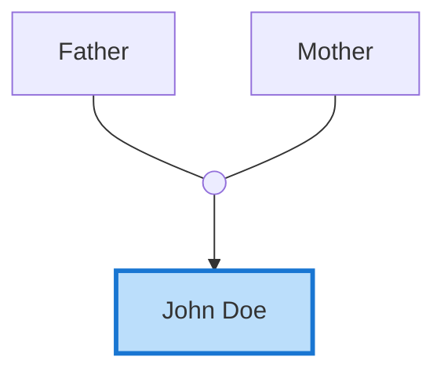

# תיעוד API - Family History Generator

## תוכן עניינים

1. [מבוא](#מבוא)
2. [מבנה המודולים](#מבנה-המודולים)
3. [Config](#config)
4. [Utils](#utils)
   - [Logger](#utilslogger)
   - [FileUtils](#utilsfile_utils)
   - [LinkConverter](#utilslink_converter)
   - [PlaceMappings](#utilsplace_mappings)
5. [GEDCOM](#gedcom)
   - [Parser](#gedcomparser)
   - [Normalizer](#gedcomnormalizer)
6. [Generators](#generators)
   - [MermaidDiagramBuilder](#generatorsmermaid_builder)
   - [ProfileGenerator](#generatorsprofile_generator)
   - [MediaIndexHandler](#generatorsmedia_handler)
   - [ChaptersIndexHandler](#generatorschapters_handler)
   - [IndexGenerators](#generatorsindex_generators)
7. [דוגמאות שימוש](#דוגמאות-שימוש)

---

## מבוא

מערכת זו מייצרת אתר משפחתי סטטי מקובץ GEDCOM. היא:
- מפרסרת קובצי GEDCOM
- מייצרת דפי פרופיל אינדיבידואליים
- בונה תרשימי משפחה (Mermaid)
- מנהלת גלריות תמונות ומסמכים
- יוצרת אינדקסים ודפי ניווט

---

## מבנה המודולים

```
scripts/
├── config.py              # קבועים גלובליים
├── doit.py                # נקודת כניסה CLI
├── gedcom/                # פרסור GEDCOM
│   ├── parser.py
│   └── normalizer.py
├── generators/            # יוצרי תוכן
│   ├── profile_generator.py
│   ├── mermaid_builder.py
│   ├── media_handler.py
│   ├── chapters_handler.py
│   └── index_generators.py
└── utils/                 # כלי עזר
    ├── logger.py
    ├── file_utils.py
    ├── link_converter.py
    └── place_mappings.py
```

---

## Config

**קובץ:** `config.py`

### קבועים

#### `IMAGE_EXTENSIONS`
```python
IMAGE_EXTENSIONS: List[str]
```
רשימת סיומות קבצי תמונה נתמכות.

**דוגמה:**
```python
IMAGE_EXTENSIONS = ['.png', '.jpg', '.jpeg', '.gif', '.webp']
```

#### `MERMAID_STYLES`
```python
MERMAID_STYLES: Dict[str, str]
```
הגדרות CSS עבור תרשימי Mermaid.

**דוגמה:**
```python
MERMAID_STYLES = {
    'person': 'fill:#e1f5fe,stroke:#0277bd,stroke-width:2px',
    'internal_link': 'fill:#e1f5fe,stroke:#0277bd,stroke-width:2px',
    'current': 'fill:#bbdefb,stroke:#1976d2,stroke-width:3px'
}
```

#### `PLACE_TO_WIKI`
```python
PLACE_TO_WIKI: Dict[str, str]
```
מיפוי ממקומות בעברית/אנגלית לשמות ערכי Wikipedia.

**דוגמה:**
```python
PLACE_TO_WIKI = {
    "Perth, Western Australia, Australia": "Perth,_Western_Australia",
    "Rehovot, Israel": "Rehovot",
    "Wien, Austria": "Vienna"
}
```

---

## Utils

### utils/logger

**קובץ:** `utils/logger.py`

מערכת logging מתקדמת עם רמות ופורמט אחיד.

#### `setup_logger(name, level=logging.INFO, log_file=None)`

מגדיר logger חדש.

**פרמטרים:**
- `name` (str): שם ה-logger (בדרך כלל שם המודול)
- `level` (int): רמת logging (DEBUG, INFO, WARNING, ERROR)
- `log_file` (str, optional): נתיב לקובץ log

**החזרה:**
- `logging.Logger`: instance של logger

**דוגמה:**
```python
from utils.logger import setup_logger
import logging

logger = setup_logger(__name__, level=logging.DEBUG)
logger.debug("This is a debug message")
logger.info("Processing started")
logger.warning("Duplicate name found")
logger.error("Failed to read file")
```

**פורמט פלט:**
```
[2024-11-26 15:30:45] [INFO] gedcom.parser: Loading GEDCOM file
[2024-11-26 15:30:46] [DEBUG] gedcom.parser: Found 150 individuals
[2024-11-26 15:30:47] [WARNING] generators.profile: Duplicate: 'John Doe'
```

#### `get_logger(name)`

מחזיר logger קיים או יוצר חדש.

**פרמטרים:**
- `name` (str): שם ה-logger

**החזרה:**
- `logging.Logger`: instance של logger

**דוגמה:**
```python
from utils.logger import get_logger

logger = get_logger(__name__)
logger.info("Using existing logger")
```

---

### utils/file_utils

**קובץ:** `utils/file_utils.py`

פונקציות עזר לניהול קבצים ותיקיות.

#### `safe_filename(name)`

ממיר מחרוזת לשם קובץ בטוח.

**פרמטרים:**
- `name` (str): שם מקורי (עשוי להכיל תווים לא חוקיים)

**החזרה:**
- `str`: שם קובץ בטוח (רק אותיות, מספרים, `-`, `_`, רווחים)

**דוגמה:**
```python
from utils.file_utils import safe_filename

# תווים מיוחדים מוחלפים
assert safe_filename("John/Doe") == "John_Doe"
assert safe_filename("Morris (Moishe)") == "Morris (Moishe)"

# תמיכה בעברית
assert safe_filename("משה כהן") == "משה כהן"
```

#### `ensure_dir(path)`

יוצר תיקייה אם היא לא קיימת.

**פרמטרים:**
- `path` (str): נתיב התיקייה

**החזרה:**
- `bool`: True אם הצליח, False אם נכשל

**דוגמה:**
```python
from utils.file_utils import ensure_dir

ensure_dir("site/content/profiles")
ensure_dir("output/images")
```

#### `copy_directory_safe(src, dst, overwrite=True)`

מעתיק תיקייה עם error handling.

**פרמטרים:**
- `src` (str): תיקיית מקור
- `dst` (str): תיקיית יעד
- `overwrite` (bool): האם למחוק יעד קיים

**החזרה:**
- `Tuple[bool, str]`: (success, error_message)

**דוגמה:**
```python
from utils.file_utils import copy_directory_safe

success, error = copy_directory_safe("bios/", "site/content/bios/")
if not success:
    logger.error(f"Copy failed: {error}")
```

---

### utils/link_converter

**קובץ:** `utils/link_converter.py`

ממיר IDs ושמות לקישורי HTML.

#### Class: `LinkConverter`

##### `__init__(individuals, id_to_slug)`

**פרמטרים:**
- `individuals` (Dict[str, Dict]): מילון אנשים מנורמל
- `id_to_slug` (Dict[str, str]): מיפוי ID -> slug ייחודי

**דוגמה:**
```python
from utils.link_converter import LinkConverter

converter = LinkConverter(individuals, id_to_slug)
```

##### `person_id_to_html(person_id)`

ממיר ID של אדם לקישור HTML.

**פרמטרים:**
- `person_id` (str): GEDCOM ID (e.g., "@I123@")

**החזרה:**
- `str`: קישור HTML או "—" אם לא נמצא

**דוגמה:**
```python
html = converter.person_id_to_html("@I11052340@")
# '<a href="/profiles/Morris-Hochman">Morris Hochman</a>'

html = converter.person_id_to_html("@I999999@")
# "—"
```

##### `extract_person_ids(text)`

מחלץ כל IDs של אנשים מטקסט.

**פרמטרים:**
- `text` (str): טקסט המכיל IDs

**החזרה:**
- `List[str]`: רשימת IDs ייחודיים (ללא @)

**תמיכה בפורמטים:**
1. `[Name|ID]` - פורמט מועדף
2. `I123456` - פורמט ישן

**דוגמה:**
```python
text = "Photo of [Morris|I11052340] and [Tobl|I11052350] in 1910"
ids = converter.extract_person_ids(text)
# ['I11052340', 'I11052350']

text = "Wedding photo with I11052340 and I39965449"
ids = converter.extract_person_ids(text)
# ['I11052340', '39965449']
```

##### `convert_ids_to_links(text)`

ממיר IDs בטקסט לקישורי HTML.

**פרמטרים:**
- `text` (str): טקסט עם IDs

**החזרה:**
- `str`: טקסט עם קישורי HTML

**דוגמה:**
```python
text = "Photo of [Morris|I11052340] in Perth"
html = converter.convert_ids_to_links(text)
# 'Photo of <a href="/profiles/Morris-Hochman">Morris</a> in Perth'
```

##### `wikilink_place(place)`

יוצר קישור Wikipedia למקום.

**פרמטרים:**
- `place` (str): שם מקום

**החזרה:**
- `str`: קישור Markdown לוויקיפדיה

**דוגמה:**
```python
link = converter.wikilink_place("Perth, Western Australia, Australia")
# '[Perth, Western Australia, Australia](https://en.wikipedia.org/wiki/Perth,_Western_Australia)'

link = converter.wikilink_place("Unknown Place")
# '[Unknown Place](https://en.wikipedia.org/wiki/Unknown_Place)'
```

---

### utils/place_mappings

**קובץ:** `utils/place_mappings.py`

מיפוי מקומות לשמות ערכי Wikipedia.

#### `get_wiki_name(place)`

מחזיר שם ערך Wikipedia למקום.

**פרמטרים:**
- `place` (str): שם מקום מלא

**החזרה:**
- `str`: שם ערך Wikipedia (עם `_` במקום רווחים)

**דוגמה:**
```python
from utils.place_mappings import get_wiki_name

wiki = get_wiki_name("Perth, Western Australia, Australia")
# "Perth,_Western_Australia"

wiki = get_wiki_name("Rehovot, Israel")
# "Rehovot"
```

---

## GEDCOM

### gedcom/parser

**קובץ:** `gedcom/parser.py`

פרסור קבצי GEDCOM.

#### `parse_gedcom_file(path)`

קורא ומפרסר קובץ GEDCOM.

**פרמטרים:**
- `path` (str): נתיב לקובץ .ged

**החזרה:**
- `Tuple[Dict, Dict]`: (individuals, families)

**מבנה individuals:**
```python
{
    "@I123@": {
        "NAME": "John Doe",
        "BIRT": {"DATE": "1900", "PLAC": "New York"},
        "DEAT": {"DATE": "1980", "PLAC": "California"},
        "FAMC": "@F10@",  # Family as child
        "FAMS": ["@F20@", "@F21@"],  # Families as spouse
        "OCCU": "Carpenter"
    }
}
```

**מבנה families:**
```python
{
    "@F10@": {
        "HUSB": "@I100@",
        "WIFE": "@I101@",
        "CHIL": ["@I123@", "@I124@"]
    }
}
```

**דוגמה:**
```python
from gedcom.parser import parse_gedcom_file

individuals, families = parse_gedcom_file("data/tree.ged")
print(f"Found {len(individuals)} people, {len(families)} families")
```

**שגיאות:**
- `FileNotFoundError`: אם הקובץ לא נמצא
- `UnicodeDecodeError`: אם encoding לא תקין

---

### gedcom/normalizer

**קובץ:** `gedcom/normalizer.py`

נורמליזציה של נתוני GEDCOM למבנה פשוט יותר.

#### `norm_individual(iid, data)`

ממיר רשומת אדם לפורמט נורמלי.

**פרמטרים:**
- `iid` (str): GEDCOM ID (e.g., "@I123@")
- `data` (Dict): נתוני GEDCOM גולמיים

**החזרה:**
- `Dict`: נתוני אדם מנורמלים

**מבנה החזרה:**
```python
{
    "id": "@I123@",
    "name": "John Doe",           # ללא /
    "birth_date": "1900",
    "birth_place": "New York",
    "death_date": "1980",
    "death_place": "California",
    "occupation": "Carpenter",
    "notes": "",
    "famc": "@F10@",              # Family as child
    "fams": ["@F20@", "@F21@"]    # Families as spouse
}
```

**דוגמה:**
```python
from gedcom.normalizer import norm_individual

raw = {
    "NAME": "John /Doe/",
    "BIRT": {"DATE": "1900", "PLAC": "New York"},
    "FAMS": "@F20@"
}
person = norm_individual("@I123@", raw)
# person["name"] == "John Doe"  (ללא /)
```

#### `norm_family(fid, data)`

ממיר רשומת משפחה לפורמט נורמלי.

**פרמטרים:**
- `fid` (str): GEDCOM family ID (e.g., "@F10@")
- `data` (Dict): נתוני GEDCOM גולמיים

**החזרה:**
- `Dict`: נתוני משפחה מנורמלים

**מבנה החזרה:**
```python
{
    "id": "@F10@",
    "husband": "@I100@",
    "wife": "@I101@",
    "children": ["@I123@", "@I124@"]
}
```

**דוגמה:**
```python
from gedcom.normalizer import norm_family

raw = {
    "HUSB": "@I100@",
    "WIFE": "@I101@",
    "CHIL": ["@I123@", "@I124@"]
}
family = norm_family("@F10@", raw)
```

#### `collect_unique_places(individuals)`

אוסף את כל המקומות הייחודיים.

**פרמטרים:**
- `individuals` (Dict): מילון אנשים (גולמי, לא מנורמל)

**החזרה:**
- `Set[str]`: קבוצת מקומות ייחודיים

**דוגמה:**
```python
from gedcom.normalizer import collect_unique_places

places = collect_unique_places(individuals)
for place in sorted(places):
    print(place)
# "New York, USA"
# "Perth, Australia"
# "Rehovot, Israel"
```

---

## Generators

### generators/mermaid_builder

**קובץ:** `generators/mermaid_builder.py`

בניית תרשימי משפחה בפורמט Mermaid.

#### Class: `MermaidDiagramBuilder`

##### `__init__(individuals, families, name_of, id_to_slug)`

**פרמטרים:**
- `individuals` (Dict): אנשים מנורמלים
- `families` (Dict): משפחות מנורמלות
- `name_of` (Dict): מיפוי ID -> שם
- `id_to_slug` (Dict): מיפוי ID -> slug ייחודי

**דוגמה:**
```python
from generators.mermaid_builder import MermaidDiagramBuilder

builder = MermaidDiagramBuilder(individuals, families, name_of, id_to_slug)
```

##### `build_immediate_family(person_id, person)`

בונה תרשים משפחה מיידית (הורים, אחים).

**פרמטרים:**
- `person_id` (str): GEDCOM ID
- `person` (Dict): נתוני אדם מנורמלים

**החזרה:**
- `str`: קוד Mermaid

**דוגמה:**
```python
diagram = builder.build_immediate_family("@I123@", person)
```

**פלט לדוגמה:**


##### `build_descendants(person_id, person, max_depth=2)`

בונה תרשים צאצאים.

**פרמטרים:**
- `person_id` (str): GEDCOM ID
- `person` (Dict): נתוני אדם מנורמלים
- `max_depth` (int): מספר דורות מקסימלי (ברירת מחדל: 2)

**החזרה:**
- `str`: קוד Mermaid

**דוגמה:**
```python
diagram = builder.build_descendants("@I123@", person, max_depth=3)
```

##### `build_ancestors(person_id, person, max_depth=2)`

בונה תרשים אבות קדמונים.

**פרמטרים:**
- `person_id` (str): GEDCOM ID
- `person` (Dict): נתוני אדם מנורמלים
- `max_depth` (int): מספר דורות מקסימלי (ברירת מחדל: 2)

**החזרה:**
- `str`: קוד Mermaid

**דוגמה:**
```python
diagram = builder.build_ancestors("@I123@", person, max_depth=3)
```

---

### generators/profile_generator

**קובץ:** `generators/profile_generator.py`

יצירת דפי פרופיל אינדיבידואליים.

#### Class: `ProfileGenerator`

##### `__init__(individuals, families, bios_dir)`

**פרמטרים:**
- `individuals` (Dict): אנשים גולמיים מ-GEDCOM
- `families` (Dict): משפחות גולמיות מ-GEDCOM
- `bios_dir` (str): נתיב לתיקיית ביוגרפיות

**דוגמה:**
```python
from generators.profile_generator import ProfileGenerator

generator = ProfileGenerator(individuals, families, "bios/")
```

##### `generate_all_profiles(output_dir)`

יוצר את כל דפי הפרופיל.

**פרמטרים:**
- `output_dir` (str): תיקיית פלט

**החזרה:**
- `Dict[str, str]`: מיפוי ID -> slug ייחודי

**דוגמה:**
```python
id_to_slug = generator.generate_all_profiles("site/content/profiles")
# יוצר 150 קבצי .md בתיקייה
```

**לוגים:**
```
[INFO] Generating 150 profiles...
[WARNING] Duplicate name: 'Leah Hoffman' (2 instances)
[INFO] Created unique slug: 'Leah-Hoffman-Nate'
[INFO] Generated 150 profiles successfully
```

##### פונקציות פנימיות (לא לשימוש ישיר)

- `_build_slug_mapping()` - בניית slugs ייחודיים
- `_detect_duplicate_names()` - זיהוי שמות כפולים
- `_fix_slug_collisions()` - תיקון התנגשויות
- `_generate_single_profile()` - יצירת פרופיל בודד
- `_collect_family_relationships()` - איסוף קשרי משפחה
- `_build_diagrams()` - בניית תרשימים
- `_build_profile_content()` - בניית Markdown
- `_write_profile_file()` - כתיבה לקובץ

---

### generators/media_handler

**קובץ:** `generators/media_handler.py`

ניהול תמונות ומסמכים.

#### Class: `MediaIndexHandler`

##### `__init__(documents_dir, static_dir, individuals=None, id_to_slug=None)`

**פרמטרים:**
- `documents_dir` (str): תיקיית documents/ מקורית
- `static_dir` (str): תיקיית static/ ליעד
- `individuals` (Dict, optional): אנשים מנורמלים (לוולידציה)
- `id_to_slug` (Dict, optional): מיפוי ID -> slug

**דוגמה:**
```python
from generators.media_handler import MediaIndexHandler

handler = MediaIndexHandler("documents/", "site/quartz/static", 
                            individuals, id_to_slug)
```

##### `create_media_index()`

יוצר את media-index.json ומעתיק קבצים.

**החזרה:**
- `Dict`: מבנה האינדקס שנוצר

**מבנה media-index.json:**
```json
{
  "images": {
    "I11052340": [
      {
        "filename": "morris_1909.jpg",
        "caption": "Photo of <a href='/profiles/Morris-Hochman'>Morris</a>",
        "people": ["I11052340", "I11052350"],
        "owner": "I11052340",
        "path": "/static/documents/I11052340/morris_1909.jpg"
      }
    ]
  },
  "documents": {
    "I11052340": [
      {
        "filename": "passport.pdf",
        "title": "Australian Passport",
        "description": "Original passport from 1909"
      }
    ]
  }
}
```

**דוגמה:**
```python
index = handler.create_media_index()
print(f"Indexed {len(index['images'])} profiles with images")
```

**לוגים:**
```
[INFO] Scanning documents directory: documents/
[DEBUG] Found 15 profile directories
[DEBUG] Processing profile I11052340
[DEBUG] Found image: morris_1909.jpg
[DEBUG] Found tagged people: ['I11052340', 'I11052350']
[INFO] Created media index with 15 profiles
[INFO] Copied 245 files to site/quartz/static/documents/
```

---

### generators/chapters_handler

**קובץ:** `generators/chapters_handler.py`

ניהול פרקי ביוגרפיה.

#### Class: `ChaptersIndexHandler`

##### `__init__(bios_dir, static_dir, individuals)`

**פרמטרים:**
- `bios_dir` (str): תיקיית bios/ מקורית
- `static_dir` (str): תיקיית static/ ליעד
- `individuals` (Dict): אנשים גולמיים (לקבלת שמות)

**דוגמה:**
```python
from generators.chapters_handler import ChaptersIndexHandler

handler = ChaptersIndexHandler("bios/", "site/quartz/static", individuals)
```

##### `create_chapters_index()`

יוצר את chapters-index.json ומעתיק קבצים.

**החזרה:**
- `Dict`: מבנה האינדקס שנוצר

**מבנה chapters-index.json:**
```json
{
  "I11052340": {
    "profileName": "Morris Hochman",
    "main": {
      "slug": "introduction",
      "name": "Introduction",
      "title": "Morris Hochman - Early Life",
      "filename": "I11052340.md"
    },
    "chapters": [
      {
        "slug": "01-in-russia",
        "name": "In Russia",
        "title": "Life in Savran",
        "filename": "01-in_russia.md"
      },
      {
        "slug": "02-journey",
        "name": "Journey",
        "title": "The Trans-Siberian Railway",
        "filename": "02-journey.md"
      }
    ]
  }
}
```

**דוגמה:**
```python
index = handler.create_chapters_index()
print(f"Indexed {len(index)} profiles with chapters")
```

**לוגים:**
```
[INFO] Creating chapters index from bios/
[DEBUG] Found chapter directory: I11052340
[DEBUG] Copied I11052340.md --> site/quartz/static/chapters/I11052340/
[DEBUG] Copied 01-in_russia.md --> site/quartz/static/chapters/I11052340/
[INFO] Added 3 chapters for I11052340
[INFO] Created chapters index with 8 profiles
```

---

### generators/index_generators

**קובץ:** `generators/index_generators.py`

יצירת דפי אינדקס וניווט.

#### `write_people_index(people_dir, pages_dir)`

יוצר דף "כל הפרופילים" (all-profiles.md).

**פרמטרים:**
- `people_dir` (str): תיקיית פרופילים
- `pages_dir` (str): תיקיית pages/

**דוגמה:**
```python
from generators.index_generators import write_people_index

write_people_index("site/content/profiles", "site/content/pages")
```

**פלט לדוגמה:**
```markdown
## All Profiles

* [Abraham Cohen](/profiles/Abraham-Cohen)
* [Bella Hoffman](/profiles/Bella-Hoffman-Hershl)
* [John Doe](/profiles/John-Doe)
...
```

#### `write_bios_index(people_dir, bios_dir, pages_dir)`

יוצר דף "פרופילים מעניינים" (profiles-of-interest.md).

**פרמטרים:**
- `people_dir` (str): תיקיית פרופילים
- `bios_dir` (str): תיקיית biographies
- `pages_dir` (str): תיקיית pages/

**דוגמה:**
```python
from generators.index_generators import write_bios_index

write_bios_index("site/content/profiles", "bios/", "site/content/pages")
```

**פלט:** רק פרופילים שיש להם ביוגרפיה מורחבת

#### `write_gallery_index(people_dir, static_dir, pages_dir)`

יוצר דף "פרופילים עם גלריה" (profiles-with-gallery.md).

**פרמטרים:**
- `people_dir` (str): תיקיית פרופילים
- `static_dir` (str): תיקיית static/ (לקריאת media-index.json)
- `pages_dir` (str): תיקיית pages/

**דוגמה:**
```python
from generators.index_generators import write_gallery_index

write_gallery_index("site/content/profiles", "site/quartz/static", "site/content/pages")
```

**פלט:** רק פרופילים שיש להם תמונות

#### `write_family_data_json(individuals, families, output_dir)`

יוצר family-data.json לתרשים עץ משפחה גדול.

**פרמטרים:**
- `individuals` (Dict): אנשים גולמיים
- `families` (Dict): משפחות גולמיות
- `output_dir` (str): תיקיית פלט

**דוגמה:**
```python
from generators.index_generators import write_family_data_json

write_family_data_json(individuals, families, "site/content/profiles")
```

**מבנה family-data.json:**
```json
{
  "people": [
    {
      "id": "I123",
      "name": "John Doe",
      "birth_date": "1900",
      "death_date": "1980",
      "famc": "F10",
      "fams": ["F20", "F21"]
    }
  ],
  "families": [
    {
      "id": "F10",
      "husband": "I100",
      "wife": "I101",
      "children": ["I123", "I124"]
    }
  ]
}
```

---

## דוגמאות שימוש

### דוגמה 1: שימוש בסיסי (CLI)

```bash
# הרצה רגילה
python scripts/doit.py data/tree.ged

# עם debug מפורט
python scripts/doit.py data/tree.ged --debug

# לוג לקובץ
python scripts/doit.py data/tree.ged --log-file=build.log

# ניתוח מקומות
python scripts/doit.py data/tree.ged --analyze-places

# ניקוי
python scripts/doit.py --clean
```

### דוגמה 2: שימוש פרוגרמטי

```python
from gedcom.parser import parse_gedcom_file
from gedcom.normalizer import norm_individual, norm_family
from generators.profile_generator import ProfileGenerator
from generators.media_handler import MediaIndexHandler
from generators.chapters_handler import ChaptersIndexHandler
from generators.index_generators import *
from utils.logger import setup_logger
import logging

# הגדרת logging
logger = setup_logger(__name__, level=logging.DEBUG)

# פרסור GEDCOM
logger.info("Parsing GEDCOM file...")
individuals, families = parse_gedcom_file("data/tree.ged")
logger.info(f"Found {len(individuals)} people, {len(families)} families")

# נורמליזציה
inds = {i: norm_individual(i, d) for i, d in individuals.items()}
fams = {f: norm_family(f, d) for f, d in families.items()}

# יצירת פרופילים
logger.info("Generating profiles...")
generator = ProfileGenerator(individuals, families, "bios/")
id_to_slug = generator.generate_all_profiles("site/content/profiles")

# יצירת אינדקס מדיה
logger.info("Creating media index...")
media_handler = MediaIndexHandler("documents/", "site/quartz/static", 
                                   inds, id_to_slug)
media_handler.create_media_index()

# יצירת אינדקס צ'פטרים
logger.info("Creating chapters index...")
chapters_handler = ChaptersIndexHandler("bios/", "site/quartz/static", 
                                         individuals)
chapters_handler.create_chapters_index()

# יצירת דפי אינדקס
logger.info("Creating index pages...")
write_people_index("site/content/profiles", "site/content/pages")
write_bios_index("site/content/profiles", "bios/", "site/content/pages")
write_gallery_index("site/content/profiles", "site/quartz/static", 
                    "site/content/pages")
write_family_data_json(individuals, families, "site/content/profiles")

logger.info("Done!")
```

### דוגמה 3: בניית תרשים Mermaid בלבד

```python
from gedcom.parser import parse_gedcom_file
from gedcom.normalizer import norm_individual, norm_family
from generators.mermaid_builder import MermaidDiagramBuilder

# טעינת נתונים
individuals, families = parse_gedcom_file("data/tree.ged")
inds = {i: norm_individual(i, d) for i, d in individuals.items()}
fams = {f: norm_family(f, d) for f, d in families.items()}
name_of = {i: info["name"] for i, info in inds.items()}

# בניית builder
id_to_slug = {}  # פשוט לדוגמה
builder = MermaidDiagramBuilder(inds, fams, name_of, id_to_slug)

# בניית תרשים עבור אדם ספציפי
person_id = "@I11052340@"
person = inds[person_id]

# תרשים משפחה מיידית
immediate = builder.build_immediate_family(person_id, person)
print(immediate)

# תרשים צאצאים (3 דורות)
descendants = builder.build_descendants(person_id, person, max_depth=3)
print(descendants)

# תרשים אבות (4 דורות)
ancestors = builder.build_ancestors(person_id, person, max_depth=4)
print(ancestors)
```

### דוגמה 4: המרת קישורים

```python
from utils.link_converter import LinkConverter

# הכנת נתונים
individuals = {
    "@I123@": {"name": "John Doe", ...},
    "@I456@": {"name": "Jane Smith", ...}
}
id_to_slug = {
    "@I123@": "John-Doe",
    "@I456@": "Jane-Smith"
}

# יצירת converter
converter = LinkConverter(individuals, id_to_slug)

# המרת ID בודד
html = converter.person_id_to_html("@I123@")
# '<a href="/profiles/John-Doe">John Doe</a>'

# חילוץ IDs מתוך כיתוב תמונה
caption = "Wedding photo of [John|I123] and [Jane|I456] in 1950"
ids = converter.extract_person_ids(caption)
# ['I123', 'I456']

# המרת הכיתוב לHTML
html_caption = converter.convert_ids_to_links(caption)
# 'Wedding photo of <a href="/profiles/John-Doe">John</a> and ...'
```

---

## הערות חשובות

### שגיאות נפוצות

1. **FileNotFoundError** - קובץ GEDCOM לא נמצא
   ```python
   # פתרון: בדוק שהנתיב נכון
   import os
   assert os.path.exists("data/tree.ged"), "GEDCOM file not found"
   ```

2. **KeyError** - ID לא קיים במילון
   ```python
   # פתרון: בדוק תמיד לפני גישה
   if person_id in individuals:
       person = individuals[person_id]
   ```

3. **UnicodeDecodeError** - בעיית encoding
   ```python
   # פתרון: פתח עם encoding מפורש
   with open(path, 'r', encoding='utf-8') as f:
       content = f.read()
   ```

### Best Practices

1. **תמיד השתמש ב-logging במקום print**
   ```python
   # לא טוב
   print(f"Processing {name}")
   
   # טוב
   logger.info(f"Processing {name}")
   ```

2. **בדוק קיום קבצים/תיקיות לפני גישה**
   ```python
   from utils.file_utils import ensure_dir
   ensure_dir("output/profiles")
   ```

3. **השתמש ב-try-except לפעולות קבצים**
   ```python
   try:
       with open(path, 'r') as f:
           data = f.read()
   except Exception as e:
       logger.error(f"Failed to read {path}: {e}")
   ```

### ביצועים

- **זמן עיבוד משוער:** ~2-5 שניות ל-150 פרופילים
- **זיכרון:** ~50-100MB לעץ בינוני (500 אנשים)
- **כותרות I/O:** הכי איטי - העתקת תמונות ומסמכים

### תאימות

- **Python:** 3.7+
- **מערכות הפעלה:** Windows, macOS, Linux
- **תלויות חיצוניות:** אין (רק ספריית תקן)

---

**גרסה:** 1.0  
**תאריך:** 2024-11-26  
**מחברים:** AI Assistant + User Collaboration

