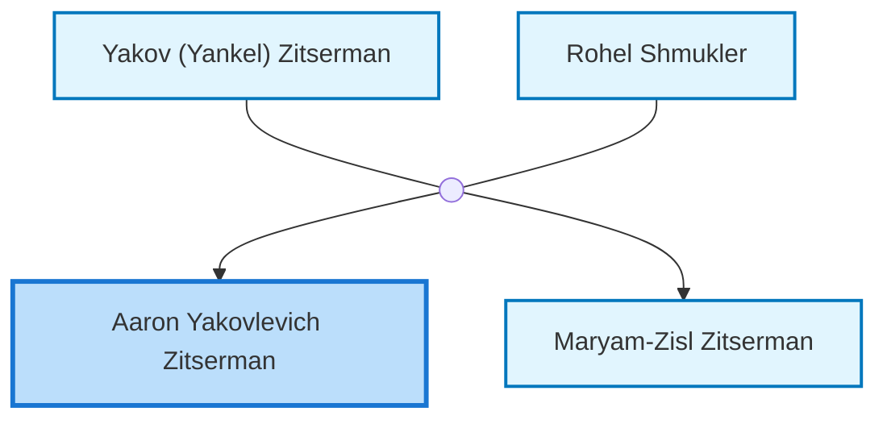
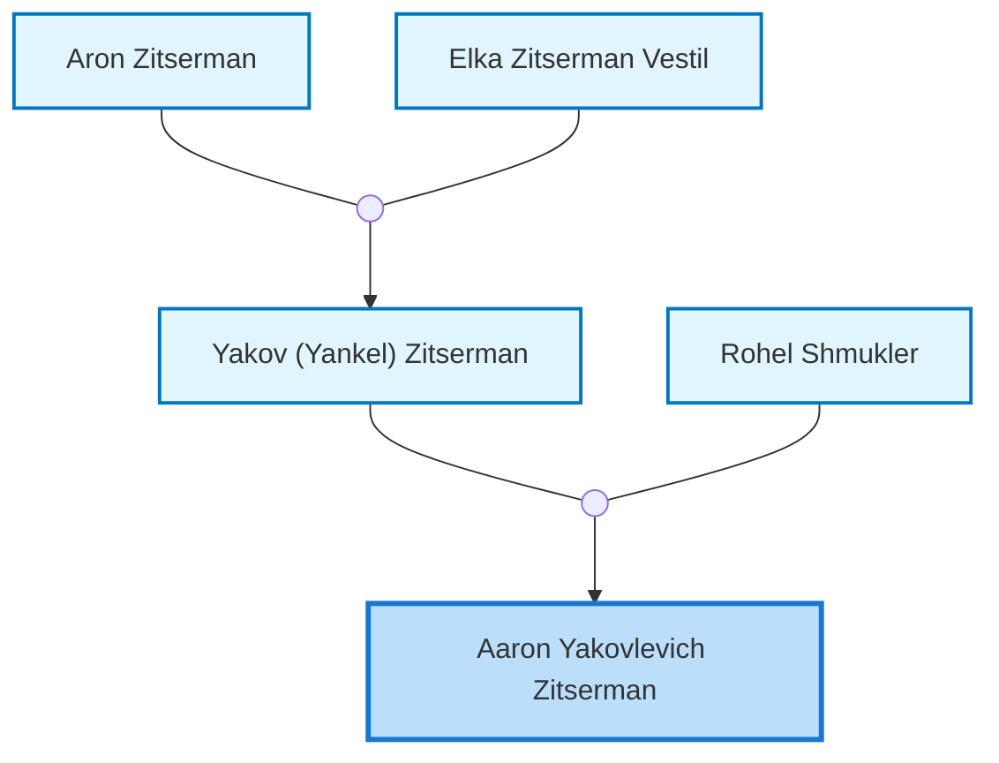

<dl class="profile-info-list">
<dt>Nick:</dt><dd>Aron</dd>
<dt>Birth:</dt><dd>circa 1908 at <a href="https://en.wikipedia.org/wiki/Chechel&#39;Nyk,_Ukraine">Chechel&#39;Nyk, Ukraine</a></dd>
<dt>Death:</dt><dd>May 17, 1942 at <a href="https://en.wikipedia.org/wiki/Barvinkove,_Kharkiv_Oblast,_Ukraine">Barvinkove, Kharkiv Oblast, Ukraine</a></dd>
<dt>Parents:</dt><dd><a href="/profiles/Yakov-%28Yankel%29-Zitserman">Yakov (Yankel) Zitserman</a>, <a href="/profiles/Rohel-Shmukler">Rohel Shmukler</a></dd>
<dt>Siblings:</dt><dd><a href="/profiles/Maryam-Zisl-Zitserman">Maryam-Zisl Zitserman</a></dd>
<dt>Spouse:</dt><dd>—</dd>
<dt>Children:</dt><dd>—</dd>
</dl>

---

## Immediate Family

## Ancestors (up to 2 Gen.)

