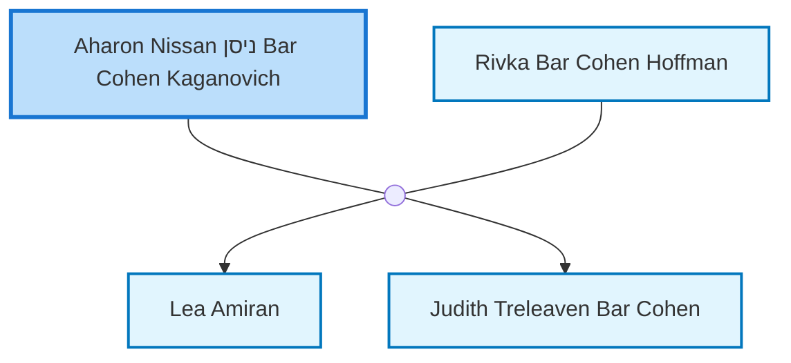

<dl class="profile-info-list">
<dt>Birth:</dt><dd>1886 at <a href="https://en.wikipedia.org/wiki/הומייל,_Gomel_District,_מחוז_גומל,_Belarus">הומייל, Gomel District, מחוז גומל, Belarus</a></dd>
<dt>Death:</dt><dd>1934 at <a href="https://en.wikipedia.org/wiki/Melbourne,_Victoria,_Australia">Melbourne, Victoria, Australia</a></dd>
<dt>Parents:</dt><dd>—</dd>
<dt>Siblings:</dt><dd>—</dd>
<dt>Spouse:</dt><dd><a href="/profiles/Rivka-Bar-Cohen-Hoffman">Rivka Bar Cohen Hoffman</a></dd>
<dt>Children:</dt><dd><a href="/profiles/Lea-Amiran">Lea Amiran</a>, <a href="/profiles/Judith-Treleaven-Bar-Cohen">Judith Treleaven Bar Cohen</a></dd>
</dl>

---

## Nuclear Family

