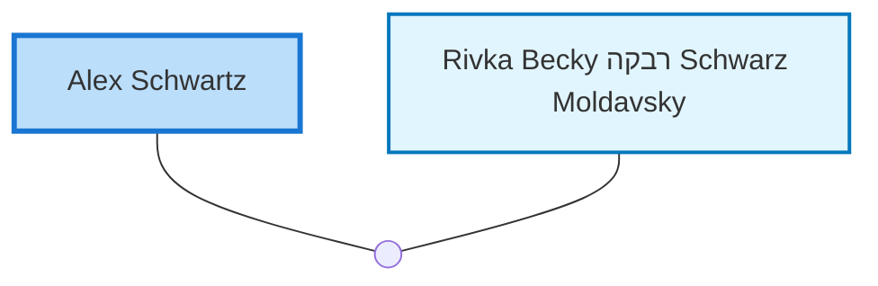

<dl class="profile-info-list">
<dt>Birth:</dt><dd>October 4, 1922 at <a href="https://en.wikipedia.org/wiki/Germany">Germany</a></dd>
<dt>Death:</dt><dd>March 13, 2008 at <a href="https://en.wikipedia.org/wiki/Ramat_Gan,_Tel_Aviv_District,_Israel">Ramat Gan, Tel Aviv District, Israel</a></dd>
<dt>Parents:</dt><dd>—</dd>
<dt>Siblings:</dt><dd>—</dd>
<dt>Spouse:</dt><dd><a href="/profiles/Rivka-Becky-%D7%A8%D7%91%D7%A7%D7%94-Schwarz-Moldavsky">Rivka Becky רבקה Schwarz Moldavsky</a></dd>
<dt>Children:</dt><dd>—</dd>
</dl>

---

## Nuclear Family

