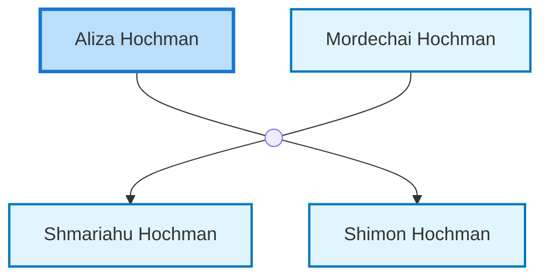

<dl class="profile-info-list">
<dt>Parents:</dt><dd>—</dd>
<dt>Siblings:</dt><dd>—</dd>
<dt>Spouse:</dt><dd><a href="/profiles/Mordechai-Hochman">Mordechai Hochman</a></dd>
<dt>Children:</dt><dd><a href="/profiles/Shmariahu-Hochman">Shmariahu Hochman</a>, <a href="/profiles/Shimon-Hochman">Shimon Hochman</a></dd>
</dl>

---

## Nuclear Family

