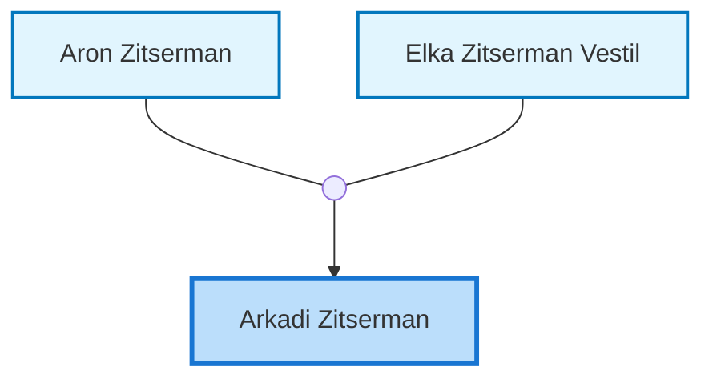
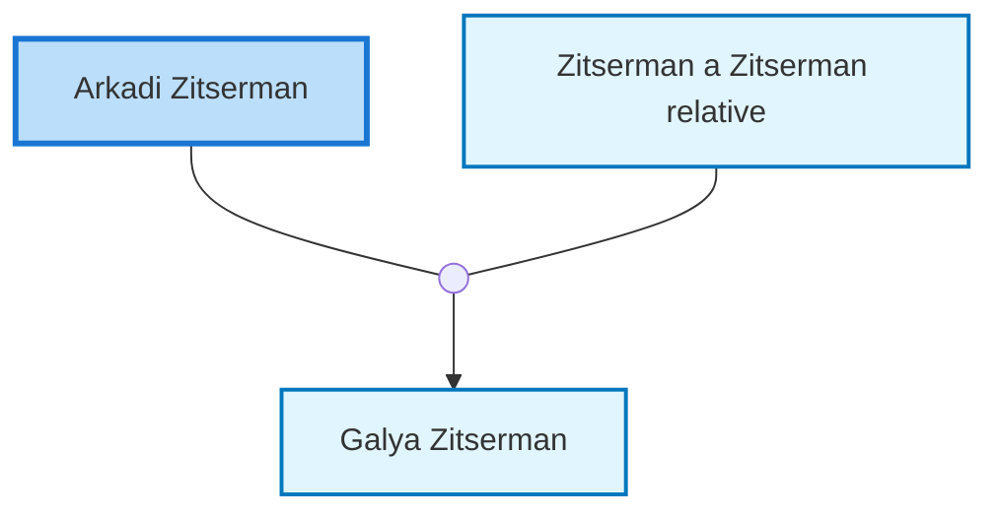

<dl class="profile-info-list">
<dt>Birth:</dt><dd> at <a href="https://en.wikipedia.org/wiki/Bershad&#39;,_Bershads&#39;kyi_district,_Vinnyts&#39;ka_oblast,_Ukraine">Bershad&#39;, Bershads&#39;kyi district, Vinnyts&#39;ka oblast, Ukraine</a></dd>
<dt>Parents:</dt><dd><a href="/profiles/Aron-Zitserman">Aron Zitserman</a>, <a href="/profiles/Elka-Zitserman-Vestil">Elka Zitserman Vestil</a></dd>
<dt>Siblings:</dt><dd><a href="/profiles/Pesja-%28Pese%29-Chwartz-%28Swartz%29-Zitserman">Pesja (Pese) Chwartz (Swartz) Zitserman</a>, <a href="/profiles/Mariam-Greenberg-Zitserman">Mariam Greenberg Zitserman</a>, <a href="/profiles/Tobl-Hochman-%28Hoffman%29-Zitserman">Tobl Hochman (Hoffman) Zitserman</a>, <a href="/profiles/Freida-Aronovna-Pesach-Zitserman">Freida Aronovna Pesach Zitserman</a>, <a href="/profiles/Yakov-%28Yankel%29-Zitserman">Yakov (Yankel) Zitserman</a></dd>
<dt>Spouse:</dt><dd><a href="/profiles/Zitserman-a-Zitserman-relative">Zitserman a Zitserman relative</a></dd>
<dt>Children:</dt><dd><a href="/profiles/Galya-Zitserman">Galya Zitserman</a></dd>
</dl>

---

## Immediate Family

```mermaid
flowchart TD
classDef person fill:#e1f5fe,stroke:#0277bd,stroke-width:2px;
classDef internal-link fill:#e1f5fe,stroke:#0277bd,stroke-width:2px;
classDef current fill:#bbdefb,stroke:#1976d2,stroke-width:3px;
idI10032069293["Arkadi Zitserman"]
class idI10032069293 current
click idI10032069293 "../profiles/Arkadi-Zitserman" "Arkadi Zitserman"
idI38736034["Aron Zitserman"]
class idI38736034 internal-link
click idI38736034 "../profiles/Aron-Zitserman" "Aron Zitserman"
idI34711365018["Elka Zitserman Vestil"]
class idI34711365018 internal-link
click idI34711365018 "../profiles/Elka-Zitserman-Vestil" "Elka Zitserman Vestil"
marriage_idF78225475((" "))
idI38736034 --- marriage_idF78225475
idI34711365018 --- marriage_idF78225475
marriage_idF78225475 --> idI10032069293
idI10033320293["Pesja (Pese) Chwartz (Swartz) Zitserman"]
class idI10033320293 internal-link
click idI10033320293 "../profiles/Pesja-%28Pese%29-Chwartz-%28Swartz%29-Zitserman" "Pesja (Pese) Chwartz (Swartz) Zitserman"
marriage_idF78225475 --> idI10033320293
idI34711365931["Mariam Greenberg Zitserman"]
class idI34711365931 internal-link
click idI34711365931 "../profiles/Mariam-Greenberg-Zitserman" "Mariam Greenberg Zitserman"
marriage_idF78225475 --> idI34711365931
idI38735986["Tobl Hochman (Hoffman) Zitserman"]
class idI38735986 internal-link
click idI38735986 "../profiles/Tobl-Hochman-%28Hoffman%29-Zitserman" "Tobl Hochman (Hoffman) Zitserman"
marriage_idF78225475 --> idI38735986
idI10032573293["Freida Aronovna Pesach Zitserman"]
class idI10032573293 internal-link
click idI10032573293 "../profiles/Freida-Aronovna-Pesach-Zitserman" "Freida Aronovna Pesach Zitserman"
marriage_idF78225475 --> idI10032573293
idI34709512624["Yakov (Yankel) Zitserman"]
class idI34709512624 internal-link
click idI34709512624 "../profiles/Yakov-%28Yankel%29-Zitserman" "Yakov (Yankel) Zitserman"
marriage_idF78225475 --> idI34709512624
```

## Ancestors (up to 2 Gen.)

## Nuclear Family

