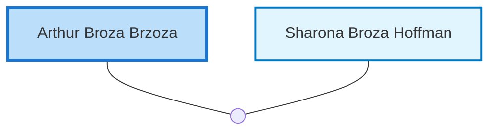

<dl class="profile-info-list">
<dt>Birth:</dt><dd>June 19, 1924 at <a href="https://en.wikipedia.org/wiki/United_Kingdom">United Kingdom</a></dd>
<dt>Death:</dt><dd>May 2003</dd>
<dt>Parents:</dt><dd>—</dd>
<dt>Siblings:</dt><dd>—</dd>
<dt>Spouse:</dt><dd><a href="/profiles/Sharona-Broza-Hoffman">Sharona Broza Hoffman</a></dd>
<dt>Children:</dt><dd>—</dd>
</dl>

---

## Nuclear Family

