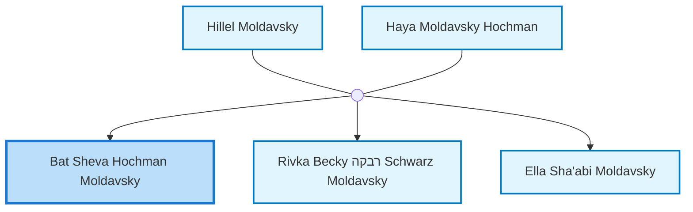
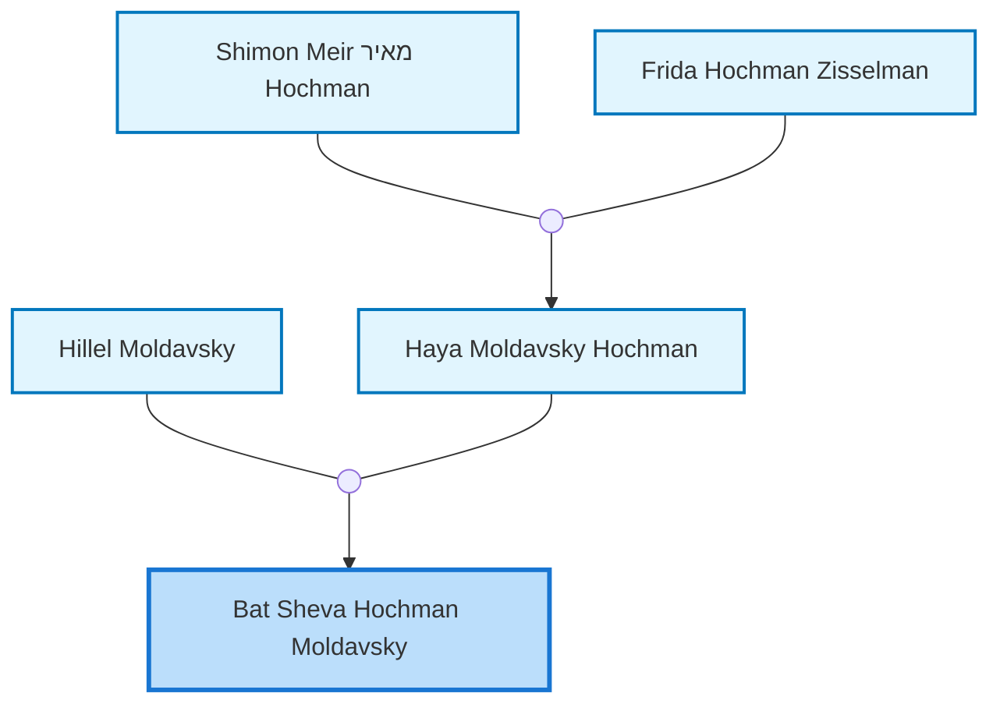
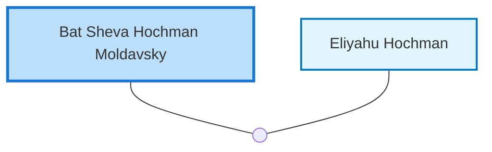

<dl class="profile-info-list">
<dt>Birth:</dt><dd>1926</dd>
<dt>Parents:</dt><dd><a href="/profiles/Hillel-Moldavsky">Hillel Moldavsky</a>, <a href="/profiles/Haya-Moldavsky-Hochman">Haya Moldavsky Hochman</a></dd>
<dt>Siblings:</dt><dd><a href="/profiles/Rivka-Becky-%D7%A8%D7%91%D7%A7%D7%94-Schwarz-Moldavsky">Rivka Becky רבקה Schwarz Moldavsky</a>, <a href="/profiles/Ella-Sha%27abi-Moldavsky">Ella Sha'abi Moldavsky</a></dd>
<dt>Spouse:</dt><dd><a href="/profiles/Eliyahu-Hochman">Eliyahu Hochman</a></dd>
<dt>Children:</dt><dd>—</dd>
</dl>

---

## Immediate Family

## Ancestors (up to 2 Gen.)

## Nuclear Family

