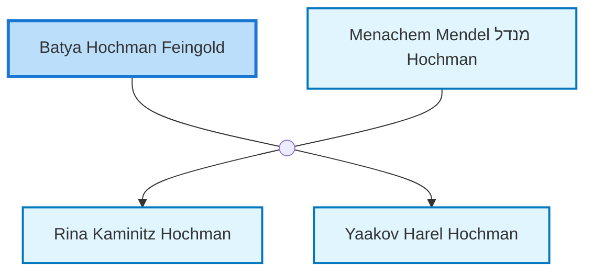

<dl class="profile-info-list">
<dt>Birth:</dt><dd>1909</dd>
<dt>Death:</dt><dd>1965</dd>
<dt>Parents:</dt><dd>—</dd>
<dt>Siblings:</dt><dd>—</dd>
<dt>Spouse:</dt><dd><a href="/profiles/Menachem-Mendel-%D7%9E%D7%A0%D7%93%D7%9C-Hochman">Menachem Mendel מנדל Hochman</a></dd>
<dt>Children:</dt><dd><a href="/profiles/Rina-Kaminitz-Hochman">Rina Kaminitz Hochman</a>, <a href="/profiles/Yaakov-Harel-Hochman">Yaakov Harel Hochman</a></dd>
</dl>

---

## Nuclear Family

