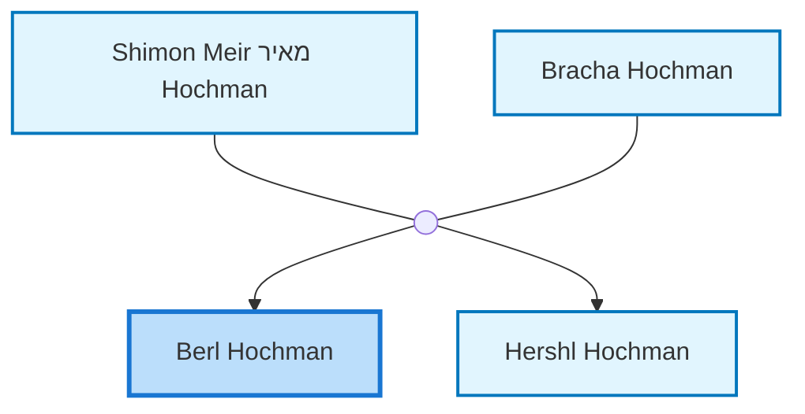
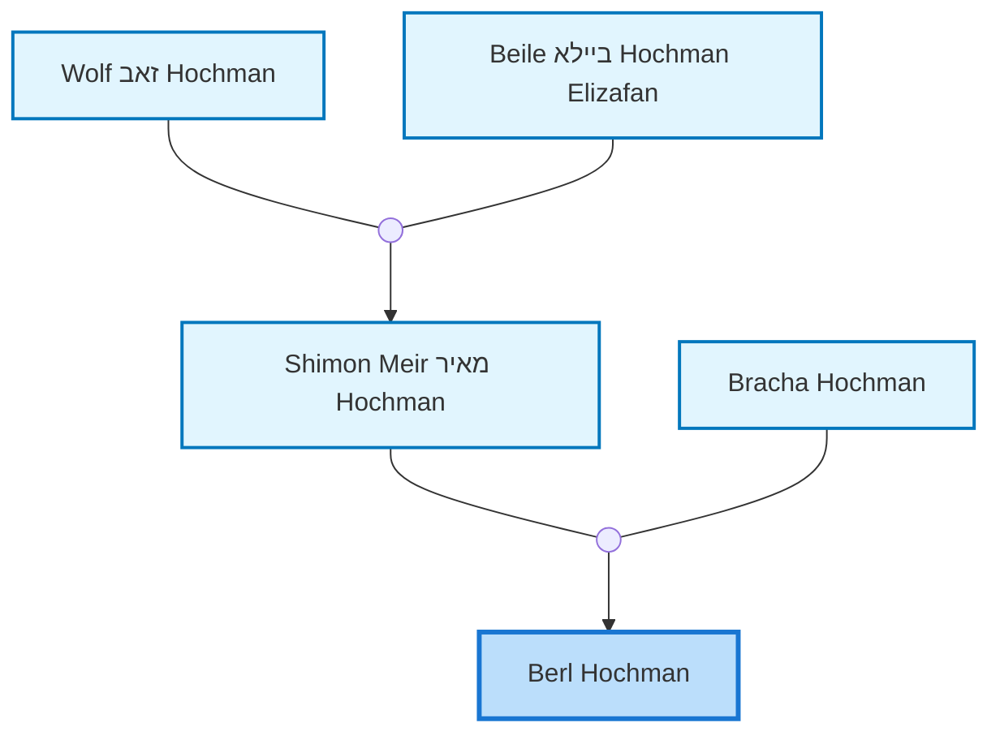
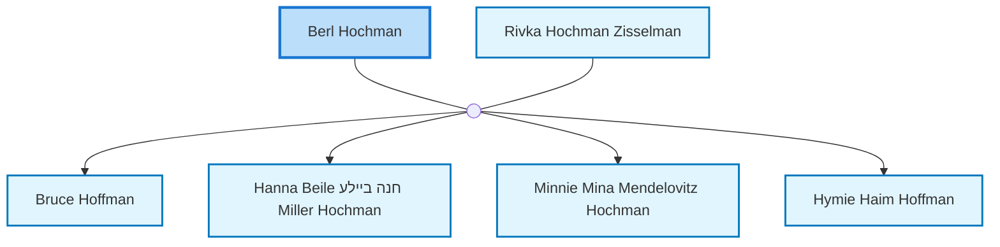

<dl class="profile-info-list">
<dt>Parents:</dt><dd><a href="/profiles/Shimon-Meir-%D7%9E%D7%90%D7%99%D7%A8-Hochman">Shimon Meir מאיר Hochman</a>, <a href="/profiles/Bracha-Hochman">Bracha Hochman</a></dd>
<dt>Siblings:</dt><dd><a href="/profiles/Hershl-Hochman">Hershl Hochman</a></dd>
<dt>Half Siblings:</dt><dd><a href="/profiles/Chaim-Nissan-%D7%A0%D7%99%D7%A1%D7%9F-Achiman-Hochman">Chaim Nissan ניסן Achiman Hochman</a>, <a href="/profiles/Haya-Moldavsky-Hochman">Haya Moldavsky Hochman</a>, <a href="/profiles/Menachem-Mendel-%D7%9E%D7%A0%D7%93%D7%9C-Hochman">Menachem Mendel מנדל Hochman</a>, <a href="/profiles/Elisheva-Hochman">Elisheva Hochman</a>, <a href="/profiles/Mordechai-Hochman">Mordechai Hochman</a>, <a href="/profiles/Elchanan-Hochman">Elchanan Hochman</a></dd>
<dt>Spouse:</dt><dd><a href="/profiles/Rivka-Hochman-Zisselman">Rivka Hochman Zisselman</a></dd>
<dt>Children:</dt><dd><a href="/profiles/Bruce-Hoffman">Bruce Hoffman</a>, <a href="/profiles/Hanna-Beile-%D7%97%D7%A0%D7%94-%D7%91%D7%99%D7%99%D7%9C%D7%A2-Miller-Hochman">Hanna Beile חנה ביילע Miller Hochman</a>, <a href="/profiles/Minnie-Mina-Mendelovitz-Hochman">Minnie Mina Mendelovitz Hochman</a>, <a href="/profiles/Hymie-Haim-Hoffman">Hymie Haim Hoffman</a></dd>
</dl>

---

## Immediate Family

## Ancestors (up to 2 Gen.)

## Nuclear Family

