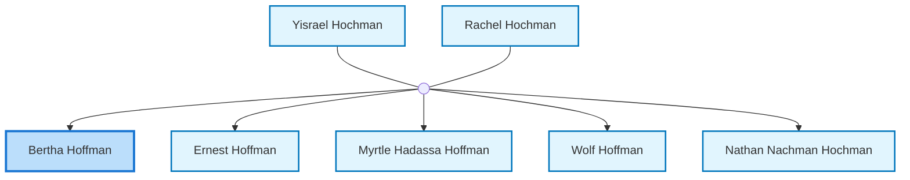
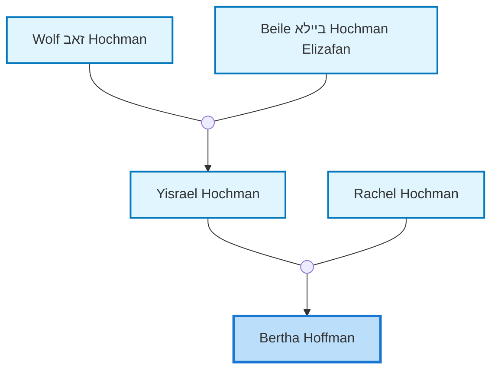

<dl class="profile-info-list">
<dt>Parents:</dt><dd><a href="/profiles/Yisrael-Hochman">Yisrael Hochman</a>, <a href="/profiles/Rachel-Hochman">Rachel Hochman</a></dd>
<dt>Siblings:</dt><dd><a href="/profiles/Ernest-Hoffman">Ernest Hoffman</a>, <a href="/profiles/Myrtle-Hadassa-Hoffman">Myrtle Hadassa Hoffman</a>, <a href="/profiles/Wolf-Hoffman-Yisrael">Wolf Hoffman</a>, <a href="/profiles/Nathan-Nachman-Hochman">Nathan Nachman Hochman</a></dd>
<dt>Spouse:</dt><dd>—</dd>
<dt>Children:</dt><dd>—</dd>
</dl>

---

## Immediate Family

## Ancestors (up to 2 Gen.)

