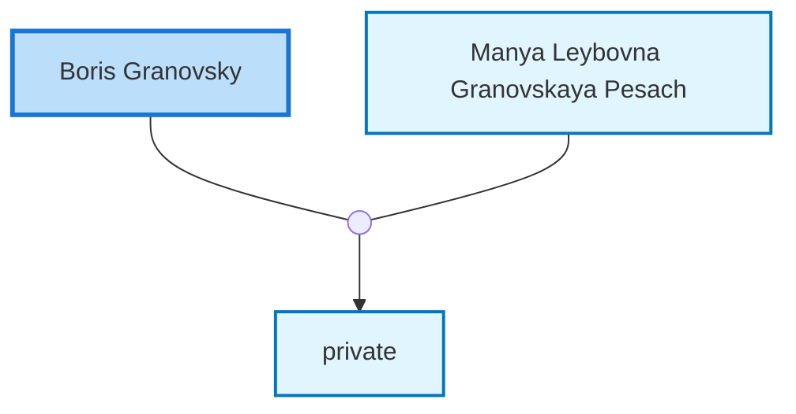

<dl class="profile-info-list">
<dt>Death:</dt><dd>circa 1942 at <a href="https://en.wikipedia.org/wiki/Volgograd,_Formerly_Stalingrad,_Russia_(Russian_Federation)">Volgograd, Formerly Stalingrad, Russia (Russian Federation)</a></dd>
<dt>Parents:</dt><dd>—</dd>
<dt>Siblings:</dt><dd>—</dd>
<dt>Spouse:</dt><dd><a href="/profiles/Manya-Leybovna-Granovskaya-Pesach">Manya Leybovna Granovskaya Pesach</a></dd>
<dt>Children:</dt><dd>private</dd>
</dl>

---

## Nuclear Family

