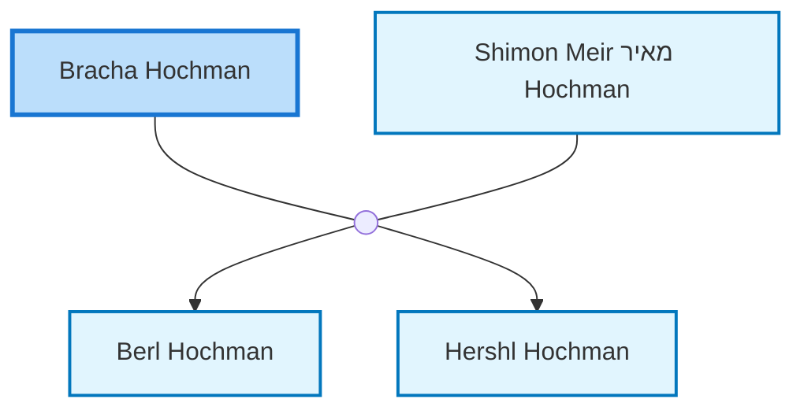

<dl class="profile-info-list">
<dt>Parents:</dt><dd>—</dd>
<dt>Siblings:</dt><dd>—</dd>
<dt>Spouse:</dt><dd><a href="/profiles/Shimon-Meir-%D7%9E%D7%90%D7%99%D7%A8-Hochman">Shimon Meir מאיר Hochman</a></dd>
<dt>Children:</dt><dd><a href="/profiles/Berl-Hochman">Berl Hochman</a>, <a href="/profiles/Hershl-Hochman">Hershl Hochman</a></dd>
</dl>

---

## Nuclear Family

