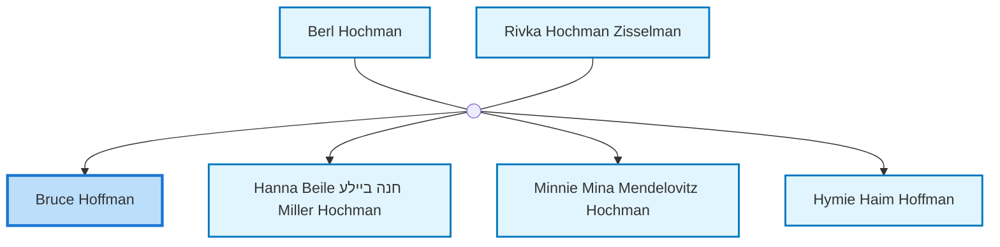
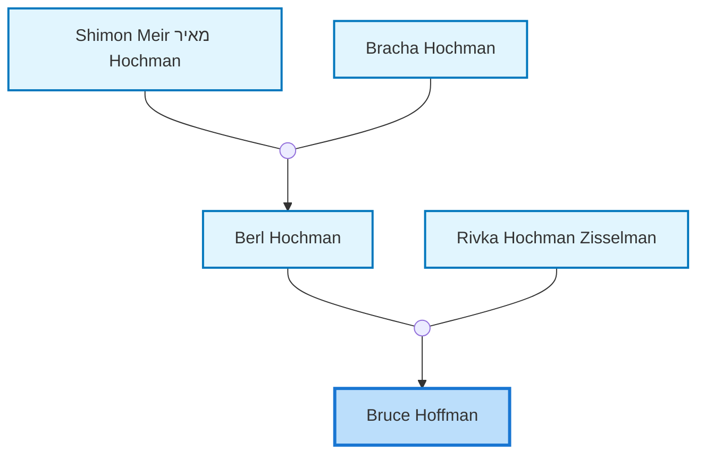
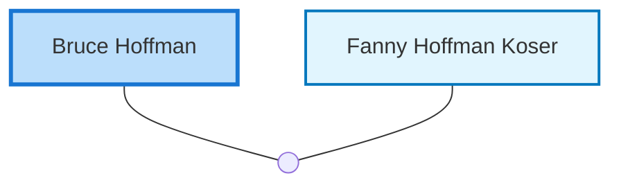

<dl class="profile-info-list">
<dt>Birth:</dt><dd>June 16, 1911 at <a href="https://en.wikipedia.org/wiki/Perth,_Western_Australia">Perth, WA, Australia</a></dd>
<dt>Parents:</dt><dd><a href="/profiles/Berl-Hochman">Berl Hochman</a>, <a href="/profiles/Rivka-Hochman-Zisselman">Rivka Hochman Zisselman</a></dd>
<dt>Siblings:</dt><dd><a href="/profiles/Hanna-Beile-%D7%97%D7%A0%D7%94-%D7%91%D7%99%D7%99%D7%9C%D7%A2-Miller-Hochman">Hanna Beile חנה ביילע Miller Hochman</a>, <a href="/profiles/Minnie-Mina-Mendelovitz-Hochman">Minnie Mina Mendelovitz Hochman</a>, <a href="/profiles/Hymie-Haim-Hoffman">Hymie Haim Hoffman</a></dd>
<dt>Spouse:</dt><dd><a href="/profiles/Fanny-Hoffman-Koser">Fanny Hoffman Koser</a></dd>
<dt>Children:</dt><dd>—</dd>
</dl>

---

## Immediate Family

## Ancestors (up to 2 Gen.)

## Nuclear Family

