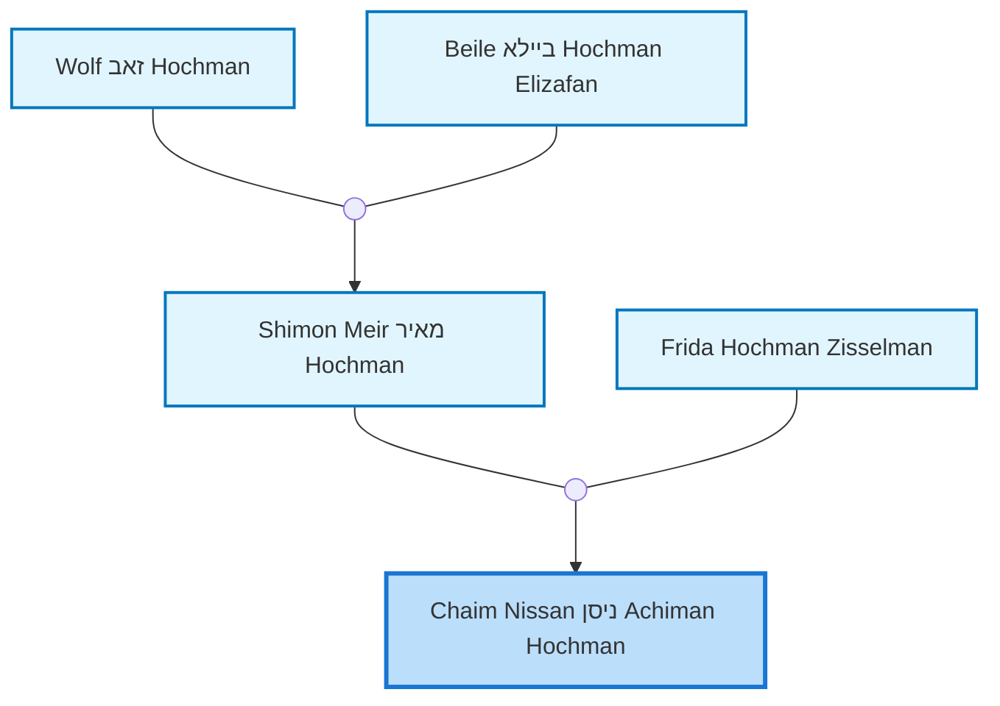
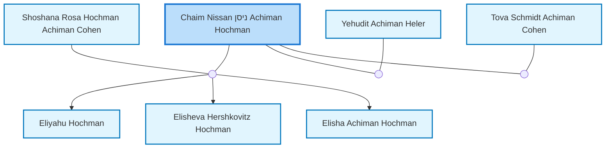

<dl class="profile-info-list">
<dt>Birth:</dt><dd>February 1, 1895 at <a href="https://en.wikipedia.org/wiki/ישראל_(Israel)">ישראל (Israel)</a></dd>
<dt>Death:</dt><dd>February 24, 1991 at <a href="https://en.wikipedia.org/wiki/Ramat_Gan,_Tel_Aviv_District,_Israel">Ramat Gan, Tel Aviv District, Israel</a></dd>
<dt>Parents:</dt><dd><a href="/profiles/Shimon-Meir-%D7%9E%D7%90%D7%99%D7%A8-Hochman">Shimon Meir מאיר Hochman</a>, <a href="/profiles/Frida-Hochman-Zisselman">Frida Hochman Zisselman</a></dd>
<dt>Siblings:</dt><dd><a href="/profiles/Haya-Moldavsky-Hochman">Haya Moldavsky Hochman</a>, <a href="/profiles/Menachem-Mendel-%D7%9E%D7%A0%D7%93%D7%9C-Hochman">Menachem Mendel מנדל Hochman</a>, <a href="/profiles/Elisheva-Hochman">Elisheva Hochman</a>, <a href="/profiles/Mordechai-Hochman">Mordechai Hochman</a>, <a href="/profiles/Elchanan-Hochman">Elchanan Hochman</a></dd>
<dt>Half Siblings:</dt><dd><a href="/profiles/Berl-Hochman">Berl Hochman</a>, <a href="/profiles/Hershl-Hochman">Hershl Hochman</a></dd>
<dt>Spouse:</dt><dd><a href="/profiles/Shoshana-Rosa-Hochman-Achiman-Cohen">Shoshana Rosa Hochman Achiman Cohen</a>, <a href="/profiles/Yehudit-Achiman-Heler">Yehudit Achiman Heler</a>, <a href="/profiles/Tova-Schmidt-Achiman-Cohen">Tova Schmidt Achiman Cohen</a></dd>
<dt>Children:</dt><dd><a href="/profiles/Eliyahu-Hochman">Eliyahu Hochman</a>, <a href="/profiles/Elisheva-Hershkovitz-Hochman">Elisheva Hershkovitz Hochman</a>, <a href="/profiles/Elisha-Achiman-Hochman">Elisha Achiman Hochman</a></dd>
</dl>

---

## Immediate Family

```mermaid
flowchart TD
classDef person fill:#e1f5fe,stroke:#0277bd,stroke-width:2px;
classDef internal-link fill:#e1f5fe,stroke:#0277bd,stroke-width:2px;
classDef current fill:#bbdefb,stroke:#1976d2,stroke-width:3px;
idI69829345["Chaim Nissan ניסן Achiman Hochman"]
class idI69829345 current
click idI69829345 "../profiles/Chaim-Nissan-%D7%A0%D7%99%D7%A1%D7%9F-Achiman-Hochman" "Chaim Nissan ניסן Achiman Hochman"
idI11060285["Shimon Meir מאיר Hochman"]
class idI11060285 internal-link
click idI11060285 "../profiles/Shimon-Meir-%D7%9E%D7%90%D7%99%D7%A8-Hochman" "Shimon Meir מאיר Hochman"
idI39965387["Frida Hochman Zisselman"]
class idI39965387 internal-link
click idI39965387 "../profiles/Frida-Hochman-Zisselman" "Frida Hochman Zisselman"
marriage_idF13655669((" "))
idI11060285 --- marriage_idF13655669
idI39965387 --- marriage_idF13655669
marriage_idF13655669 --> idI69829345
idI39965656["Haya Moldavsky Hochman"]
class idI39965656 internal-link
click idI39965656 "../profiles/Haya-Moldavsky-Hochman" "Haya Moldavsky Hochman"
marriage_idF13655669 --> idI39965656
idI39965615["Menachem Mendel מנדל Hochman"]
class idI39965615 internal-link
click idI39965615 "../profiles/Menachem-Mendel-%D7%9E%D7%A0%D7%93%D7%9C-Hochman" "Menachem Mendel מנדל Hochman"
marriage_idF13655669 --> idI39965615
idI39965722["Elisheva Hochman"]
class idI39965722 internal-link
click idI39965722 "../profiles/Elisheva-Hochman" "Elisheva Hochman"
marriage_idF13655669 --> idI39965722
idI39965692["Mordechai Hochman"]
class idI39965692 internal-link
click idI39965692 "../profiles/Mordechai-Hochman" "Mordechai Hochman"
marriage_idF13655669 --> idI39965692
idI41031001["Elchanan Hochman"]
class idI41031001 internal-link
click idI41031001 "../profiles/Elchanan-Hochman" "Elchanan Hochman"
marriage_idF13655669 --> idI41031001
```

## Ancestors (up to 2 Gen.)

## Nuclear Family

