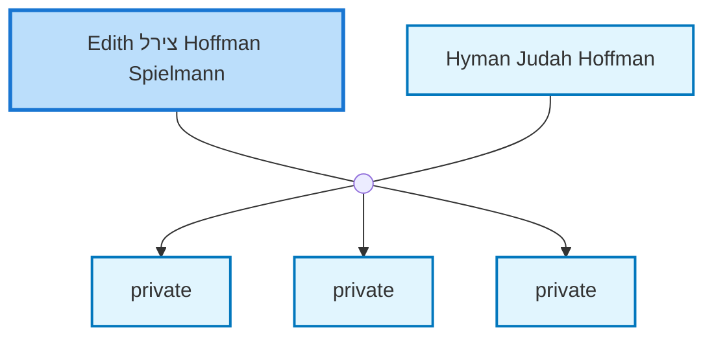

<dl class="profile-info-list">
<dt>Birth:</dt><dd>November 27, 1918 at <a href="https://en.wikipedia.org/wiki/Vienna">Wien, Austria</a></dd>
<dt>Death:</dt><dd>January 2, 2008 at <a href="https://en.wikipedia.org/wiki/Perth,_Western_Australia">Perth, Western Australia, Australia</a></dd>
<dt>Parents:</dt><dd>—</dd>
<dt>Siblings:</dt><dd>—</dd>
<dt>Spouse:</dt><dd><a href="/profiles/Hyman-Judah-Hoffman">Hyman Judah Hoffman</a></dd>
<dt>Children:</dt><dd>private, private, private</dd>
</dl>

---

## Nuclear Family

