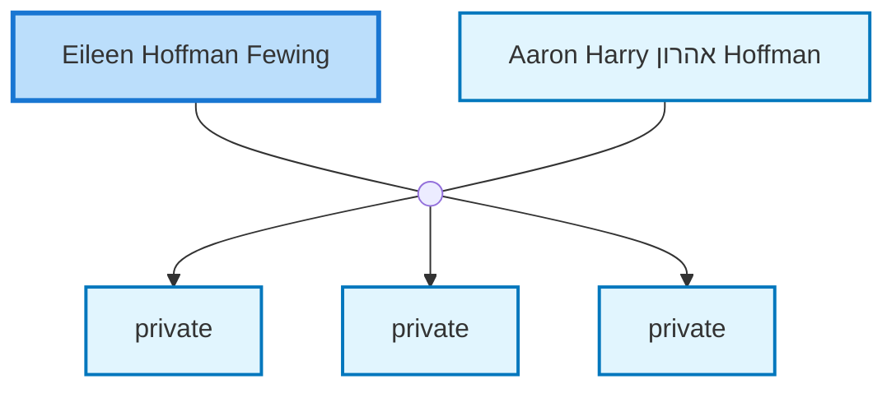

<dl class="profile-info-list">
<dt>Parents:</dt><dd>—</dd>
<dt>Siblings:</dt><dd>—</dd>
<dt>Spouse:</dt><dd><a href="/profiles/Aaron-Harry-%D7%90%D7%94%D7%A8%D7%95%D7%9F-Hoffman">Aaron Harry אהרון Hoffman</a></dd>
<dt>Children:</dt><dd>private, private, private</dd>
</dl>

---

## Nuclear Family

