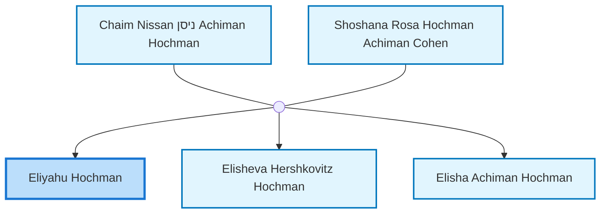
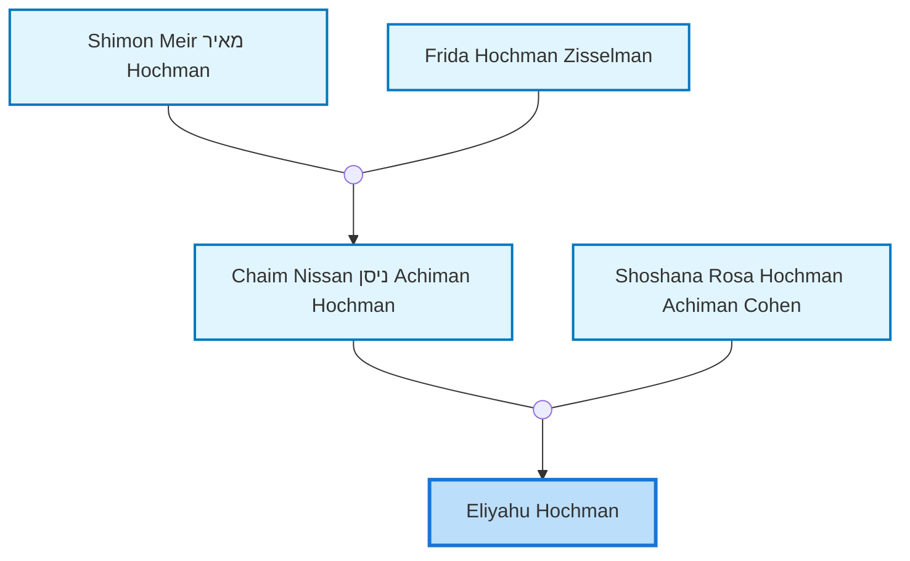
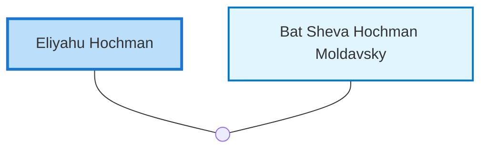

<dl class="profile-info-list">
<dt>Birth:</dt><dd>1920 at <a href="https://en.wikipedia.org/wiki/Tel_Aviv-Yafo,_Tel_Aviv_District,_Israel">Tel Aviv-Yafo, Tel Aviv District, Israel</a></dd>
<dt>Death:</dt><dd>September 3, 2017</dd>
<dt>Parents:</dt><dd><a href="/profiles/Chaim-Nissan-%D7%A0%D7%99%D7%A1%D7%9F-Achiman-Hochman">Chaim Nissan ניסן Achiman Hochman</a>, <a href="/profiles/Shoshana-Rosa-Hochman-Achiman-Cohen">Shoshana Rosa Hochman Achiman Cohen</a></dd>
<dt>Siblings:</dt><dd><a href="/profiles/Elisheva-Hershkovitz-Hochman">Elisheva Hershkovitz Hochman</a>, <a href="/profiles/Elisha-Achiman-Hochman">Elisha Achiman Hochman</a></dd>
<dt>Spouse:</dt><dd><a href="/profiles/Bat-Sheva-Hochman-Moldavsky">Bat Sheva Hochman Moldavsky</a></dd>
<dt>Children:</dt><dd>—</dd>
</dl>

---

## Immediate Family

## Ancestors (up to 2 Gen.)

## Nuclear Family

