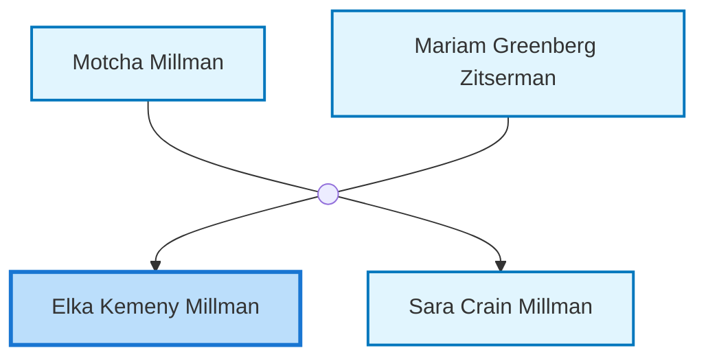
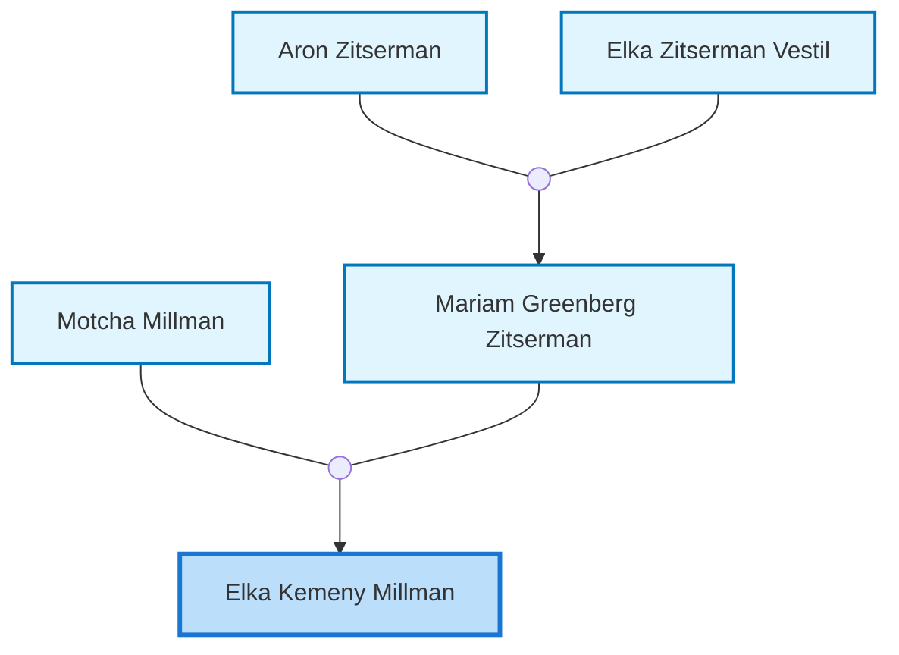
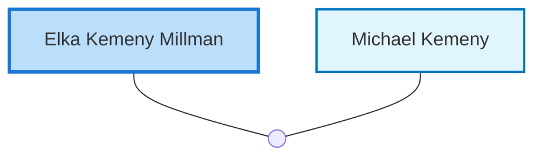

<dl class="profile-info-list">
<dt>Nick:</dt><dd>Alice</dd>
<dt>Birth:</dt><dd>circa 1931</dd>
<dt>Death:</dt><dd>July 12, 2014 at <a href="https://en.wikipedia.org/wiki/Perth,_Western_Australia">Perth, Australia</a></dd>
<dt>Parents:</dt><dd><a href="/profiles/Motcha-Millman">Motcha Millman</a>, <a href="/profiles/Mariam-Greenberg-Zitserman">Mariam Greenberg Zitserman</a></dd>
<dt>Siblings:</dt><dd><a href="/profiles/Sara-Crain-Millman">Sara Crain Millman</a></dd>
<dt>Spouse:</dt><dd><a href="/profiles/Michael-Kemeny">Michael Kemeny</a></dd>
<dt>Children:</dt><dd>—</dd>
</dl>

---

## Immediate Family

## Ancestors (up to 2 Gen.)

## Nuclear Family

