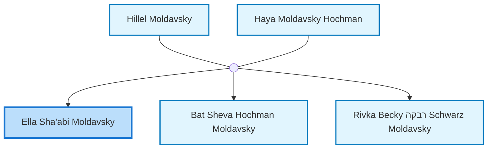
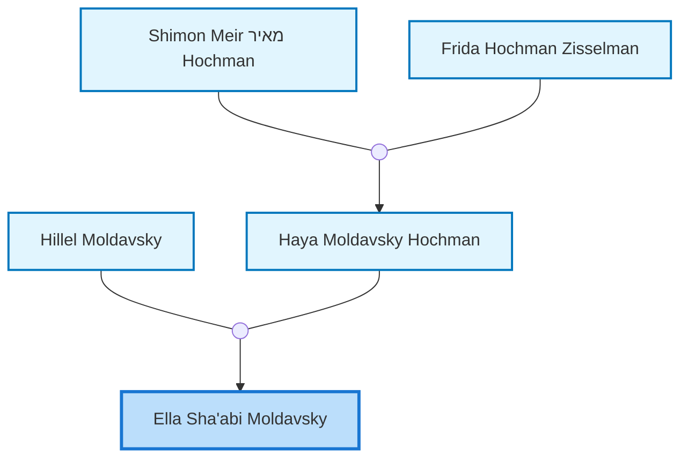
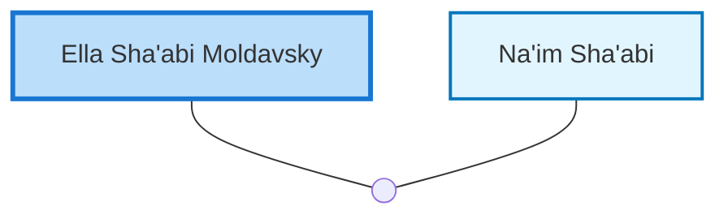

<dl class="profile-info-list">
<dt>Birth:</dt><dd>September 22, 1932 at <a href="https://en.wikipedia.org/wiki/Perth,_Western_Australia">Perth, Western Australia, Australia</a></dd>
<dt>Parents:</dt><dd><a href="/profiles/Hillel-Moldavsky">Hillel Moldavsky</a>, <a href="/profiles/Haya-Moldavsky-Hochman">Haya Moldavsky Hochman</a></dd>
<dt>Siblings:</dt><dd><a href="/profiles/Bat-Sheva-Hochman-Moldavsky">Bat Sheva Hochman Moldavsky</a>, <a href="/profiles/Rivka-Becky-%D7%A8%D7%91%D7%A7%D7%94-Schwarz-Moldavsky">Rivka Becky רבקה Schwarz Moldavsky</a></dd>
<dt>Spouse:</dt><dd><a href="/profiles/Na%27im-Sha%27abi">Na'im Sha'abi</a></dd>
<dt>Children:</dt><dd>—</dd>
</dl>

---

## Immediate Family

## Ancestors (up to 2 Gen.)

## Nuclear Family

