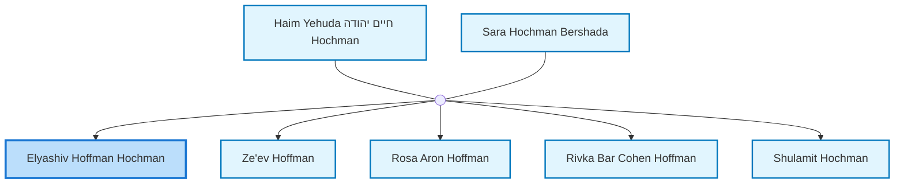
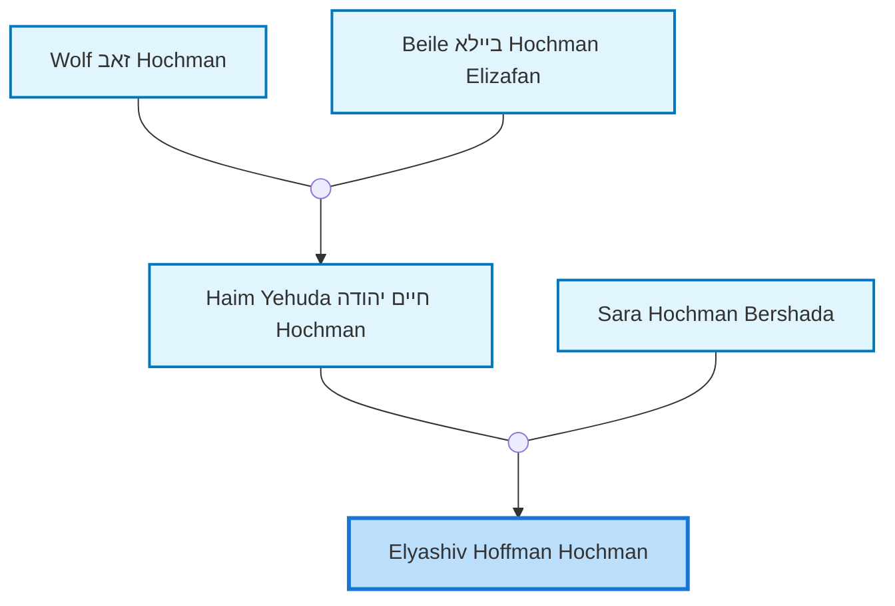
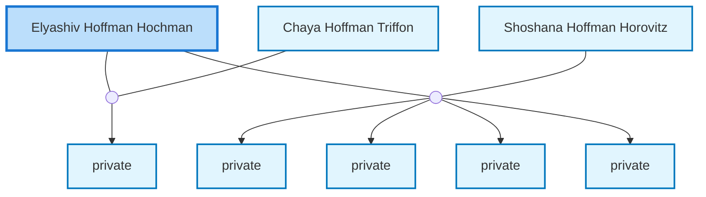

<dl class="profile-info-list">
<dt>Nick:</dt><dd>Elik</dd>
<dt>Birth:</dt><dd>February 5, 1911 at <a href="https://en.wikipedia.org/wiki/Perth,_Western_Australia">Perth, Western Australia, Australia</a></dd>
<dt>Death:</dt><dd>February 17, 1974</dd>
<dt>Parents:</dt><dd><a href="/profiles/Haim-Yehuda-%D7%97%D7%99%D7%99%D7%9D-%D7%99%D7%94%D7%95%D7%93%D7%94-Hochman">Haim Yehuda חיים יהודה Hochman</a>, <a href="/profiles/Sara-Hochman-Bershada">Sara Hochman Bershada</a></dd>
<dt>Siblings:</dt><dd><a href="/profiles/Ze%27ev-Hoffman">Ze'ev Hoffman</a>, <a href="/profiles/Rosa-Aron-Hoffman">Rosa Aron Hoffman</a>, <a href="/profiles/Rivka-Bar-Cohen-Hoffman">Rivka Bar Cohen Hoffman</a>, <a href="/profiles/Shulamit-Hochman">Shulamit Hochman</a></dd>
<dt>Spouse:</dt><dd><a href="/profiles/Chaya-Hoffman-Triffon">Chaya Hoffman Triffon</a>, <a href="/profiles/Shoshana-Hoffman-Horovitz">Shoshana Hoffman Horovitz</a></dd>
<dt>Children:</dt><dd>private, private, private, private, private</dd>
</dl>

---

## Immediate Family

## Ancestors (up to 2 Gen.)

## Nuclear Family

