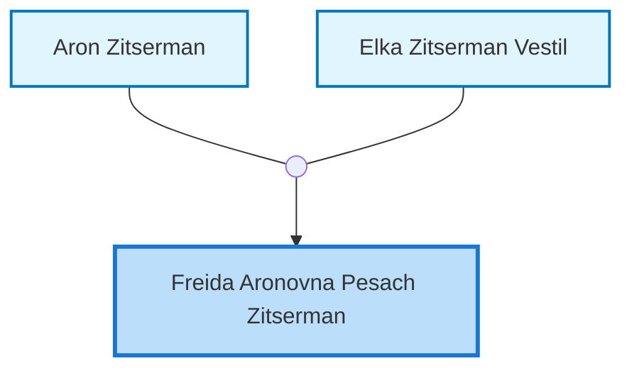

<dl class="profile-info-list">
<dt>Nick:</dt><dd>Frida, Freyda, Freda</dd>
<dt>Birth:</dt><dd>circa 1882 at <a href="https://en.wikipedia.org/wiki/Bershad">Bershad, Ukraine</a></dd>
<dt>Death:</dt><dd>circa 1950 at <a href="https://en.wikipedia.org/wiki/Odessa,_Ukraine">Odessa, Ukraine</a></dd>
<dt>Parents:</dt><dd><a href="/profiles/Aron-Zitserman">Aron Zitserman</a>, <a href="/profiles/Elka-Zitserman-Vestil">Elka Zitserman Vestil</a></dd>
<dt>Siblings:</dt><dd><a href="/profiles/Arkadi-Zitserman">Arkadi Zitserman</a>, <a href="/profiles/Pesja-%28Pese%29-Chwartz-%28Swartz%29-Zitserman">Pesja (Pese) Chwartz (Swartz) Zitserman</a>, <a href="/profiles/Mariam-Greenberg-Zitserman">Mariam Greenberg Zitserman</a>, <a href="/profiles/Tobl-Hochman-%28Hoffman%29-Zitserman">Tobl Hochman (Hoffman) Zitserman</a>, <a href="/profiles/Yakov-%28Yankel%29-Zitserman">Yakov (Yankel) Zitserman</a></dd>
<dt>Spouse:</dt><dd><a href="/profiles/Leyb-Pesach">Leyb Pesach</a></dd>
<dt>Children:</dt><dd><a href="/profiles/Manya-Leybovna-Granovskaya-Pesach">Manya Leybovna Granovskaya Pesach</a>, <a href="/profiles/Arkadi-Aron-Pesach">Arkadi Aron Pesach</a>, <a href="/profiles/Bronya-%28Bracha%29-Pesach">Bronya (Bracha) Pesach</a>, <a href="/profiles/Yakov-%28Yasha%29-Leybovich-Pesach">Yakov (Yasha) Leybovich Pesach</a>, <a href="/profiles/Yaakov-%28Yankele%29-Pesach">Yaakov (Yankele) Pesach</a>, <a href="/profiles/Charna-Pesach">Charna Pesach</a>, <a href="/profiles/Fanya-%28Feiga%29-Zvesdina-Pesach">Fanya (Feiga) Zvesdina Pesach</a></dd>
</dl>

---

## Immediate Family

```mermaid
flowchart TD
classDef person fill:#e1f5fe,stroke:#0277bd,stroke-width:2px;
classDef internal-link fill:#e1f5fe,stroke:#0277bd,stroke-width:2px;
classDef current fill:#bbdefb,stroke:#1976d2,stroke-width:3px;
idI10032573293["Freida Aronovna Pesach Zitserman"]
class idI10032573293 current
click idI10032573293 "../profiles/Freida-Aronovna-Pesach-Zitserman" "Freida Aronovna Pesach Zitserman"
idI38736034["Aron Zitserman"]
class idI38736034 internal-link
click idI38736034 "../profiles/Aron-Zitserman" "Aron Zitserman"
idI34711365018["Elka Zitserman Vestil"]
class idI34711365018 internal-link
click idI34711365018 "../profiles/Elka-Zitserman-Vestil" "Elka Zitserman Vestil"
marriage_idF78225475((" "))
idI38736034 --- marriage_idF78225475
idI34711365018 --- marriage_idF78225475
marriage_idF78225475 --> idI10032573293
idI10032069293["Arkadi Zitserman"]
class idI10032069293 internal-link
click idI10032069293 "../profiles/Arkadi-Zitserman" "Arkadi Zitserman"
marriage_idF78225475 --> idI10032069293
idI10033320293["Pesja (Pese) Chwartz (Swartz) Zitserman"]
class idI10033320293 internal-link
click idI10033320293 "../profiles/Pesja-%28Pese%29-Chwartz-%28Swartz%29-Zitserman" "Pesja (Pese) Chwartz (Swartz) Zitserman"
marriage_idF78225475 --> idI10033320293
idI34711365931["Mariam Greenberg Zitserman"]
class idI34711365931 internal-link
click idI34711365931 "../profiles/Mariam-Greenberg-Zitserman" "Mariam Greenberg Zitserman"
marriage_idF78225475 --> idI34711365931
idI38735986["Tobl Hochman (Hoffman) Zitserman"]
class idI38735986 internal-link
click idI38735986 "../profiles/Tobl-Hochman-%28Hoffman%29-Zitserman" "Tobl Hochman (Hoffman) Zitserman"
marriage_idF78225475 --> idI38735986
idI34709512624["Yakov (Yankel) Zitserman"]
class idI34709512624 internal-link
click idI34709512624 "../profiles/Yakov-%28Yankel%29-Zitserman" "Yakov (Yankel) Zitserman"
marriage_idF78225475 --> idI34709512624
```

## Ancestors (up to 2 Gen.)

## Nuclear Family

```mermaid
flowchart TD
classDef person fill:#e1f5fe,stroke:#0277bd,stroke-width:2px;
classDef internal-link fill:#e1f5fe,stroke:#0277bd,stroke-width:2px;
classDef current fill:#bbdefb,stroke:#1976d2,stroke-width:3px;
idI10032573293["Freida Aronovna Pesach Zitserman"]
class idI10032573293 current
click idI10032573293 "../profiles/Freida-Aronovna-Pesach-Zitserman" "Freida Aronovna Pesach Zitserman"
idI34836330579["Leyb Pesach"]
class idI34836330579 internal-link
click idI34836330579 "../profiles/Leyb-Pesach" "Leyb Pesach"
marriage_idF121235501((" "))
idI10032573293 --- marriage_idF121235501
idI34836330579 --- marriage_idF121235501
idI34836330561["Manya Leybovna Granovskaya Pesach"]
class idI34836330561 internal-link
click idI34836330561 "../profiles/Manya-Leybovna-Granovskaya-Pesach" "Manya Leybovna Granovskaya Pesach"
marriage_idF121235501 --> idI34836330561
idI34845671910["Arkadi Aron Pesach"]
class idI34845671910 internal-link
click idI34845671910 "../profiles/Arkadi-Aron-Pesach" "Arkadi Aron Pesach"
marriage_idF121235501 --> idI34845671910
idI34845671740["Bronya (Bracha) Pesach"]
class idI34845671740 internal-link
click idI34845671740 "../profiles/Bronya-%28Bracha%29-Pesach" "Bronya (Bracha) Pesach"
marriage_idF121235501 --> idI34845671740
idI34837761123["Yakov (Yasha) Leybovich Pesach"]
class idI34837761123 internal-link
click idI34837761123 "../profiles/Yakov-%28Yasha%29-Leybovich-Pesach" "Yakov (Yasha) Leybovich Pesach"
marriage_idF121235501 --> idI34837761123
idI34845671953["Yaakov (Yankele) Pesach"]
class idI34845671953 internal-link
click idI34845671953 "../profiles/Yaakov-%28Yankele%29-Pesach" "Yaakov (Yankele) Pesach"
marriage_idF121235501 --> idI34845671953
idI34845671643["Charna Pesach"]
class idI34845671643 internal-link
click idI34845671643 "../profiles/Charna-Pesach" "Charna Pesach"
marriage_idF121235501 --> idI34845671643
idI34845671700["Fanya (Feiga) Zvesdina Pesach"]
class idI34845671700 internal-link
click idI34845671700 "../profiles/Fanya-%28Feiga%29-Zvesdina-Pesach" "Fanya (Feiga) Zvesdina Pesach"
marriage_idF121235501 --> idI34845671700
```

