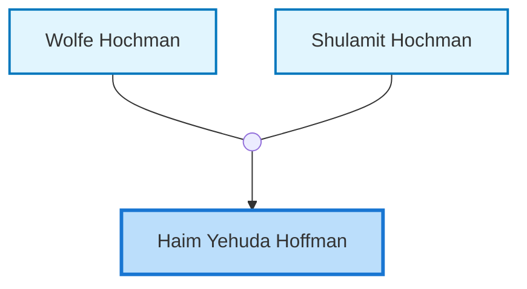
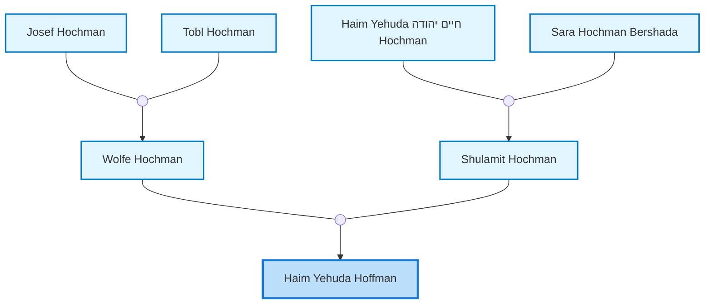
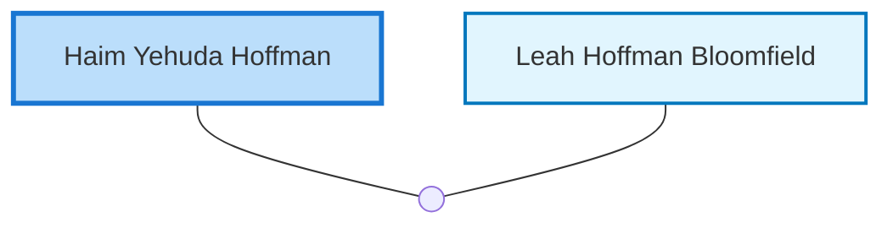

<dl class="profile-info-list">
<dt>Parents:</dt><dd><a href="/profiles/Wolfe-Hochman">Wolfe Hochman</a>, <a href="/profiles/Shulamit-Hochman">Shulamit Hochman</a></dd>
<dt>Siblings:</dt><dd>—</dd>
<dt>Spouse:</dt><dd><a href="/profiles/Leah-Hoffman-Bloomfield">Leah Hoffman Bloomfield</a></dd>
<dt>Children:</dt><dd>—</dd>
</dl>

---

## Immediate Family

## Ancestors (up to 2 Gen.)

## Nuclear Family

