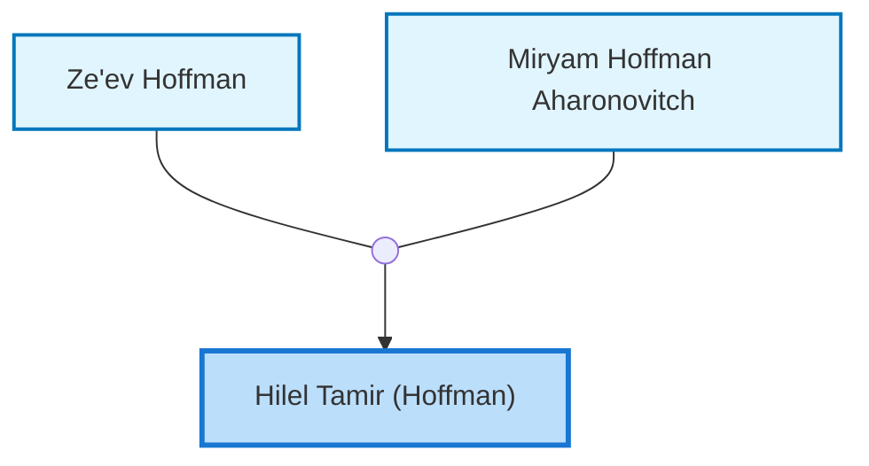
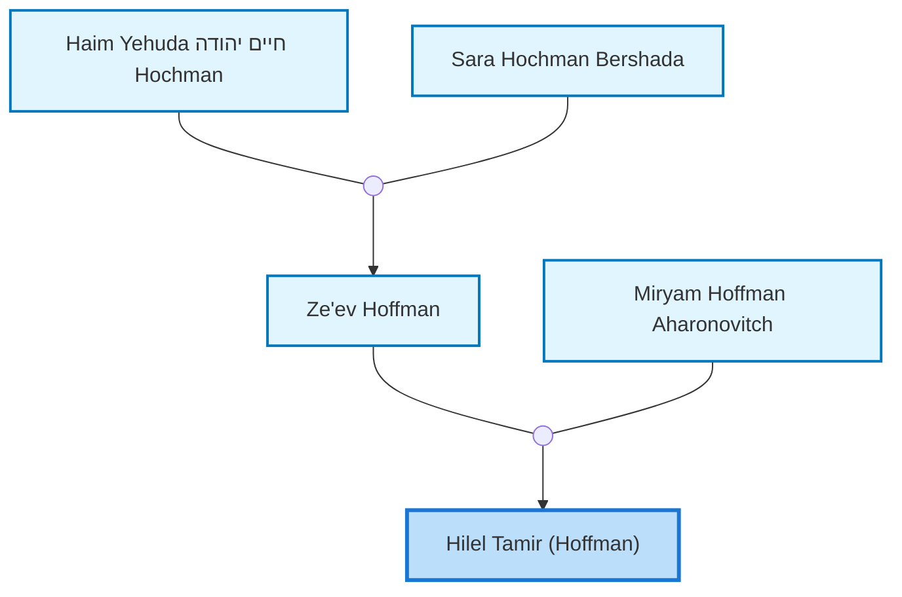
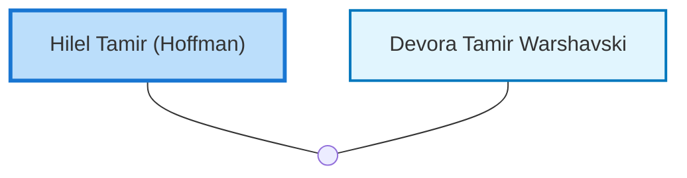

<dl class="profile-info-list">
<dt>Parents:</dt><dd><a href="/profiles/Ze%27ev-Hoffman">Ze'ev Hoffman</a>, <a href="/profiles/Miryam-Hoffman-Aharonovitch">Miryam Hoffman Aharonovitch</a></dd>
<dt>Siblings:</dt><dd>—</dd>
<dt>Spouse:</dt><dd><a href="/profiles/Devora-Tamir-Warshavski">Devora Tamir Warshavski</a></dd>
<dt>Children:</dt><dd>—</dd>
</dl>

---

## Immediate Family

## Ancestors (up to 2 Gen.)

## Nuclear Family

