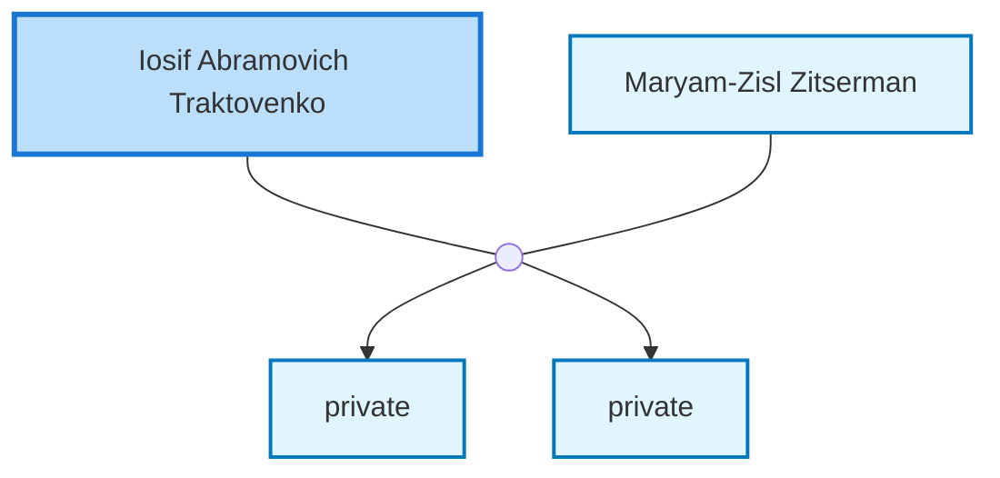

<dl class="profile-info-list">
<dt>Birth:</dt><dd>January 9, 1913 at <a href="https://en.wikipedia.org/wiki/Chechel&#39;Nyk,_Chechel&#39;nyts&#39;kyi_district,_Vinnytsia_Oblast,_Ukraine">Chechel&#39;Nyk, Chechel&#39;nyts&#39;kyi district, Vinnytsia Oblast, Ukraine</a></dd>
<dt>Death:</dt><dd>1989</dd>
<dt>Parents:</dt><dd>—</dd>
<dt>Siblings:</dt><dd>—</dd>
<dt>Spouse:</dt><dd><a href="/profiles/Maryam-Zisl-Zitserman">Maryam-Zisl Zitserman</a></dd>
<dt>Children:</dt><dd>private, private</dd>
</dl>

---

## Nuclear Family

