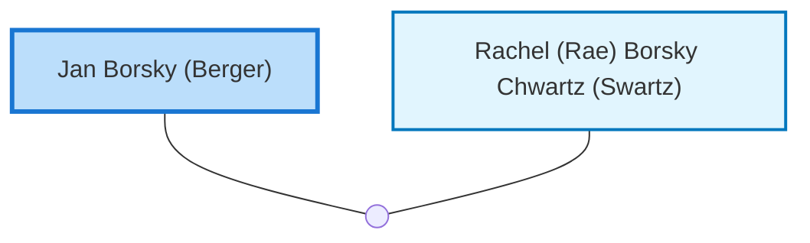

<dl class="profile-info-list">
<dt>Nick:</dt><dd>Jay</dd>
<dt>Birth:</dt><dd>February 7, 1918</dd>
<dt>Death:</dt><dd>April 5, 2005</dd>
<dt>Parents:</dt><dd>—</dd>
<dt>Siblings:</dt><dd>—</dd>
<dt>Spouse:</dt><dd><a href="/profiles/Rachel-%28Rae%29-Borsky-Chwartz-%28Swartz%29">Rachel (Rae) Borsky Chwartz (Swartz)</a></dd>
<dt>Children:</dt><dd>—</dd>
</dl>

---

## Nuclear Family

