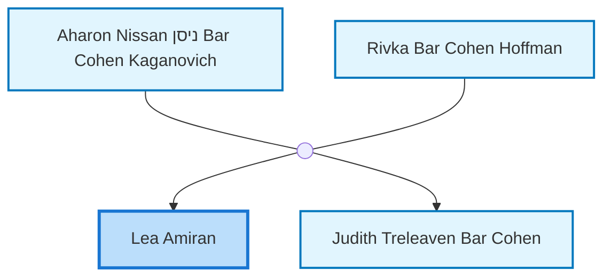
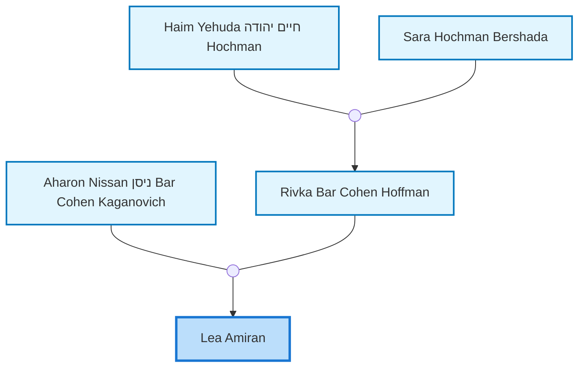
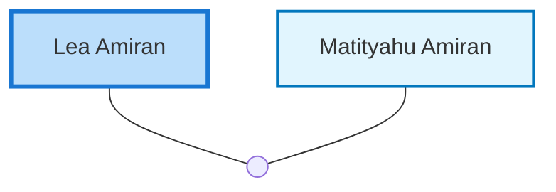

<dl class="profile-info-list">
<dt>Birth:</dt><dd>1912 at <a href="https://en.wikipedia.org/wiki/Australia">Australia</a></dd>
<dt>Death:</dt><dd>February 26, 1997 at <a href="https://en.wikipedia.org/wiki/Israel">Israel</a></dd>
<dt>Parents:</dt><dd><a href="/profiles/Aharon-Nissan-%D7%A0%D7%99%D7%A1%D7%9F-Bar-Cohen-Kaganovich">Aharon Nissan ניסן Bar Cohen Kaganovich</a>, <a href="/profiles/Rivka-Bar-Cohen-Hoffman">Rivka Bar Cohen Hoffman</a></dd>
<dt>Siblings:</dt><dd><a href="/profiles/Judith-Treleaven-Bar-Cohen">Judith Treleaven Bar Cohen</a></dd>
<dt>Spouse:</dt><dd><a href="/profiles/Matityahu-Amiran">Matityahu Amiran</a></dd>
<dt>Children:</dt><dd>—</dd>
</dl>

---

## Immediate Family

## Ancestors (up to 2 Gen.)

## Nuclear Family

