<dl class="profile-info-list">
<dt>Nick:</dt><dd>Leib Peysakh</dd>
<dt>Birth:</dt><dd> at <a href="https://en.wikipedia.org/wiki/Olhopil,_Formerly_Olgopol,_Ukraine">Olhopil, Formerly Olgopol, Ukraine</a></dd>
<dt>Death:</dt><dd>circa 1938 at <a href="https://en.wikipedia.org/wiki/Odessa,_Ukraine">Odessa, Ukraine</a></dd>
<dt>Parents:</dt><dd>—</dd>
<dt>Siblings:</dt><dd>—</dd>
<dt>Spouse:</dt><dd><a href="/profiles/Freida-Aronovna-Pesach-Zitserman">Freida Aronovna Pesach Zitserman</a></dd>
<dt>Children:</dt><dd><a href="/profiles/Manya-Leybovna-Granovskaya-Pesach">Manya Leybovna Granovskaya Pesach</a>, <a href="/profiles/Arkadi-Aron-Pesach">Arkadi Aron Pesach</a>, <a href="/profiles/Bronya-%28Bracha%29-Pesach">Bronya (Bracha) Pesach</a>, <a href="/profiles/Yakov-%28Yasha%29-Leybovich-Pesach">Yakov (Yasha) Leybovich Pesach</a>, <a href="/profiles/Yaakov-%28Yankele%29-Pesach">Yaakov (Yankele) Pesach</a>, <a href="/profiles/Charna-Pesach">Charna Pesach</a>, <a href="/profiles/Fanya-%28Feiga%29-Zvesdina-Pesach">Fanya (Feiga) Zvesdina Pesach</a></dd>
</dl>

---

## Nuclear Family

```mermaid
flowchart TD
classDef person fill:#e1f5fe,stroke:#0277bd,stroke-width:2px;
classDef internal-link fill:#e1f5fe,stroke:#0277bd,stroke-width:2px;
classDef current fill:#bbdefb,stroke:#1976d2,stroke-width:3px;
idI34836330579["Leyb Pesach"]
class idI34836330579 current
click idI34836330579 "../profiles/Leyb-Pesach" "Leyb Pesach"
idI10032573293["Freida Aronovna Pesach Zitserman"]
class idI10032573293 internal-link
click idI10032573293 "../profiles/Freida-Aronovna-Pesach-Zitserman" "Freida Aronovna Pesach Zitserman"
marriage_idF121235501((" "))
idI34836330579 --- marriage_idF121235501
idI10032573293 --- marriage_idF121235501
idI34836330561["Manya Leybovna Granovskaya Pesach"]
class idI34836330561 internal-link
click idI34836330561 "../profiles/Manya-Leybovna-Granovskaya-Pesach" "Manya Leybovna Granovskaya Pesach"
marriage_idF121235501 --> idI34836330561
idI34845671910["Arkadi Aron Pesach"]
class idI34845671910 internal-link
click idI34845671910 "../profiles/Arkadi-Aron-Pesach" "Arkadi Aron Pesach"
marriage_idF121235501 --> idI34845671910
idI34845671740["Bronya (Bracha) Pesach"]
class idI34845671740 internal-link
click idI34845671740 "../profiles/Bronya-%28Bracha%29-Pesach" "Bronya (Bracha) Pesach"
marriage_idF121235501 --> idI34845671740
idI34837761123["Yakov (Yasha) Leybovich Pesach"]
class idI34837761123 internal-link
click idI34837761123 "../profiles/Yakov-%28Yasha%29-Leybovich-Pesach" "Yakov (Yasha) Leybovich Pesach"
marriage_idF121235501 --> idI34837761123
idI34845671953["Yaakov (Yankele) Pesach"]
class idI34845671953 internal-link
click idI34845671953 "../profiles/Yaakov-%28Yankele%29-Pesach" "Yaakov (Yankele) Pesach"
marriage_idF121235501 --> idI34845671953
idI34845671643["Charna Pesach"]
class idI34845671643 internal-link
click idI34845671643 "../profiles/Charna-Pesach" "Charna Pesach"
marriage_idF121235501 --> idI34845671643
idI34845671700["Fanya (Feiga) Zvesdina Pesach"]
class idI34845671700 internal-link
click idI34845671700 "../profiles/Fanya-%28Feiga%29-Zvesdina-Pesach" "Fanya (Feiga) Zvesdina Pesach"
marriage_idF121235501 --> idI34845671700
```

