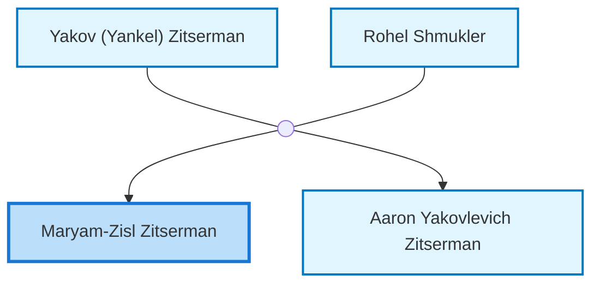
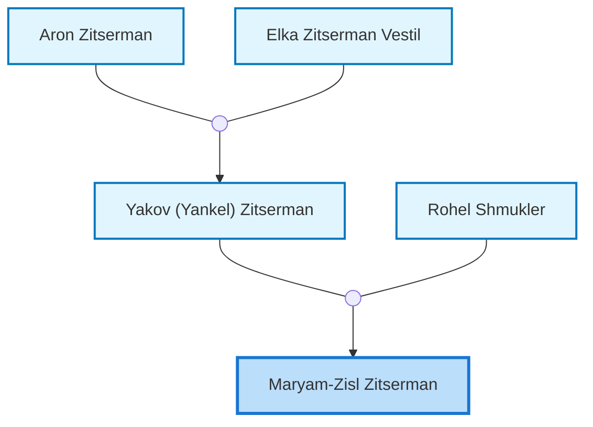
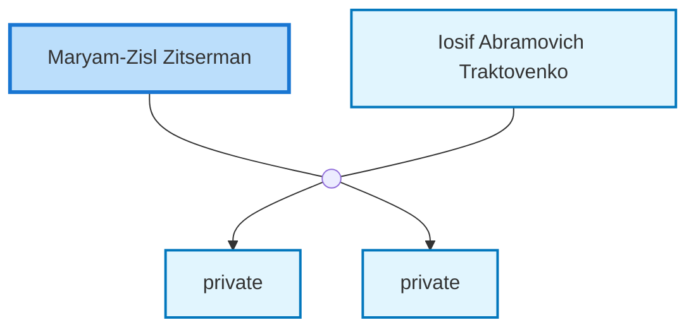

<dl class="profile-info-list">
<dt>Nick:</dt><dd>Maria</dd>
<dt>Birth:</dt><dd>June 6, 1913 at <a href="https://en.wikipedia.org/wiki/Ukraine">Ukraine</a></dd>
<dt>Death:</dt><dd>March 29, 2000 at <a href="https://en.wikipedia.org/wiki/Mountain_View,_Santa_Clara_County,_California,_United_States">Mountain View, Santa Clara County, California, United States</a></dd>
<dt>Occupation:</dt><dd>Scientist/Researcher PhD in Chemistry</dd>
<dt>Parents:</dt><dd><a href="/profiles/Yakov-%28Yankel%29-Zitserman">Yakov (Yankel) Zitserman</a>, <a href="/profiles/Rohel-Shmukler">Rohel Shmukler</a></dd>
<dt>Siblings:</dt><dd><a href="/profiles/Aaron-Yakovlevich-Zitserman">Aaron Yakovlevich Zitserman</a></dd>
<dt>Spouse:</dt><dd><a href="/profiles/Iosif-Abramovich-Traktovenko">Iosif Abramovich Traktovenko</a></dd>
<dt>Children:</dt><dd>private, private</dd>
</dl>

---

## Immediate Family

## Ancestors (up to 2 Gen.)

## Nuclear Family

