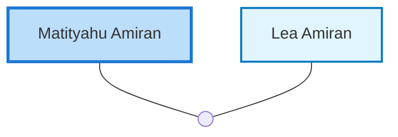

<dl class="profile-info-list">
<dt>Nick:</dt><dd>Pugi</dd>
<dt>Birth:</dt><dd>1910</dd>
<dt>Death:</dt><dd>circa 1983</dd>
<dt>Parents:</dt><dd>—</dd>
<dt>Siblings:</dt><dd>—</dd>
<dt>Spouse:</dt><dd><a href="/profiles/Lea-Amiran">Lea Amiran</a></dd>
<dt>Children:</dt><dd>—</dd>
</dl>

---

## Nuclear Family

