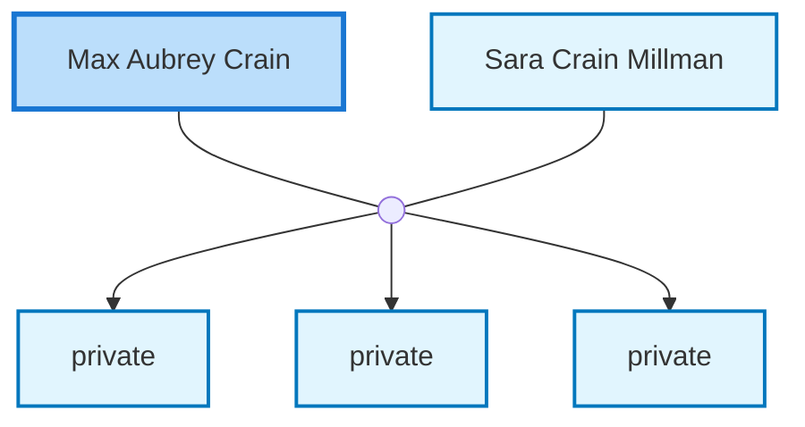

<dl class="profile-info-list">
<dt>Birth:</dt><dd>October 5, 1914 at <a href="https://en.wikipedia.org/wiki/Roff,_Pontotoc_County,_OK,_United_States">Roff, Pontotoc County, OK, United States</a></dd>
<dt>Death:</dt><dd>February 1, 1995 at <a href="https://en.wikipedia.org/wiki/Los_Angeles,_Los_Angeles_County,_CA,_United_States">Los Angeles, Los Angeles County, CA, United States</a></dd>
<dt>Parents:</dt><dd>—</dd>
<dt>Siblings:</dt><dd>—</dd>
<dt>Spouse:</dt><dd><a href="/profiles/Sara-Crain-Millman">Sara Crain Millman</a></dd>
<dt>Children:</dt><dd>private, private, private</dd>
</dl>

---

## Nuclear Family

