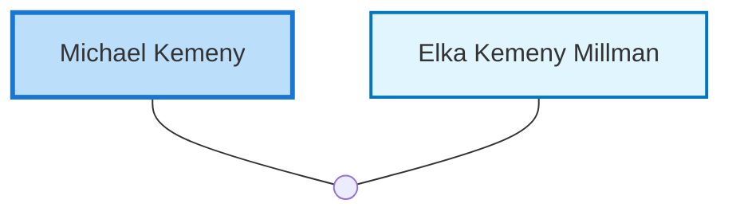

<dl class="profile-info-list">
<dt>Birth:</dt><dd>circa 1926</dd>
<dt>Death:</dt><dd>February 4, 2024 at <a href="https://en.wikipedia.org/wiki/Perth,_Western_Australia">Perth, Australia</a></dd>
<dt>Parents:</dt><dd>—</dd>
<dt>Siblings:</dt><dd>—</dd>
<dt>Spouse:</dt><dd><a href="/profiles/Elka-Kemeny-Millman">Elka Kemeny Millman</a></dd>
<dt>Children:</dt><dd>—</dd>
</dl>

---

## Nuclear Family

