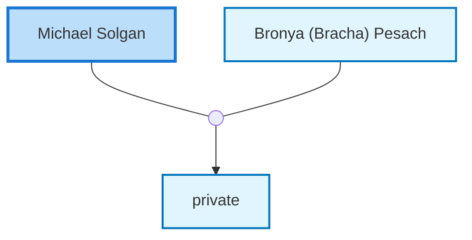

<dl class="profile-info-list">
<dt>Birth:</dt><dd> at <a href="https://en.wikipedia.org/wiki/Ol&#39;Hopil&#39;_(Olgopol),_Ukraine">Ol&#39;Hopil&#39; (Olgopol), Ukraine</a></dd>
<dt>Death:</dt><dd>circa 1942</dd>
<dt>Parents:</dt><dd>—</dd>
<dt>Siblings:</dt><dd>—</dd>
<dt>Spouse:</dt><dd><a href="/profiles/Bronya-%28Bracha%29-Pesach">Bronya (Bracha) Pesach</a></dd>
<dt>Children:</dt><dd>private</dd>
</dl>

---

## Nuclear Family

