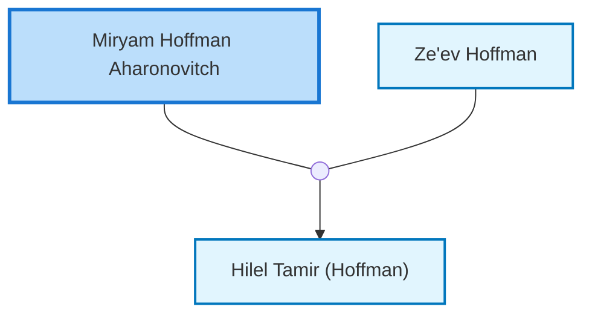

<dl class="profile-info-list">
<dt>Parents:</dt><dd>—</dd>
<dt>Siblings:</dt><dd>—</dd>
<dt>Spouse:</dt><dd><a href="/profiles/Ze%27ev-Hoffman">Ze'ev Hoffman</a></dd>
<dt>Children:</dt><dd><a href="/profiles/Hilel-Tamir-%28Hoffman%29">Hilel Tamir (Hoffman)</a></dd>
</dl>

---

## Nuclear Family

