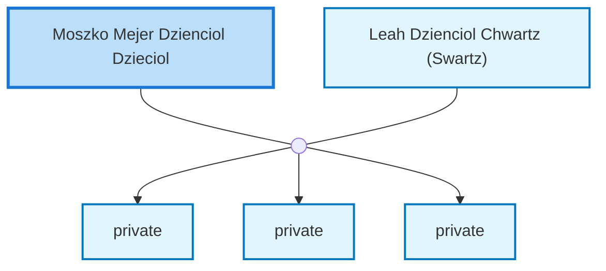

<dl class="profile-info-list">
<dt>Nick:</dt><dd>Morry, Morris, Maurice, Moshe</dd>
<dt>Birth:</dt><dd>July 14, 1913 at <a href="https://en.wikipedia.org/wiki/Biala_Podlaska,_Poland">Biala Podlaska, Poland</a></dd>
<dt>Death:</dt><dd>June 24, 2002 at <a href="https://en.wikipedia.org/wiki/Perth,_Western_Australia">Perth, Australia</a></dd>
<dt>Parents:</dt><dd>—</dd>
<dt>Siblings:</dt><dd>—</dd>
<dt>Spouse:</dt><dd><a href="/profiles/Leah-Dzienciol-Chwartz-%28Swartz%29">Leah Dzienciol Chwartz (Swartz)</a></dd>
<dt>Children:</dt><dd>private, private, private</dd>
</dl>

---

## Nuclear Family

