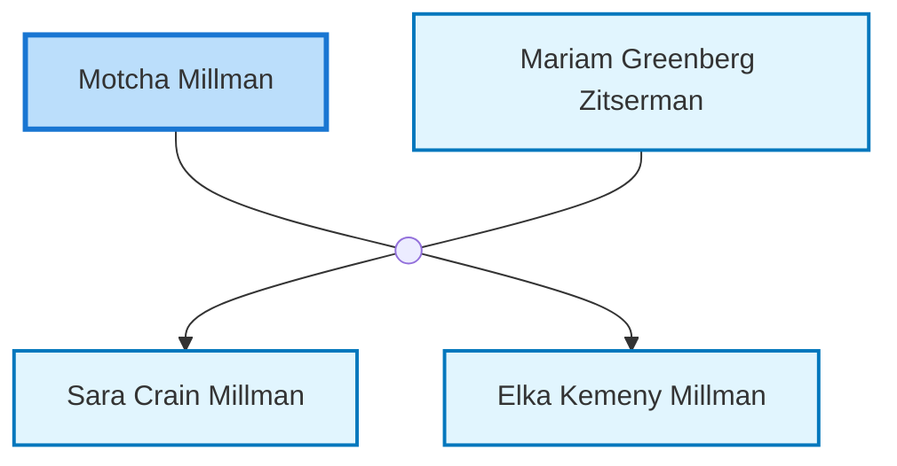

<dl class="profile-info-list">
<dt>Parents:</dt><dd>—</dd>
<dt>Siblings:</dt><dd>—</dd>
<dt>Spouse:</dt><dd><a href="/profiles/Mariam-Greenberg-Zitserman">Mariam Greenberg Zitserman</a></dd>
<dt>Children:</dt><dd><a href="/profiles/Sara-Crain-Millman">Sara Crain Millman</a>, <a href="/profiles/Elka-Kemeny-Millman">Elka Kemeny Millman</a></dd>
</dl>

---

## Nuclear Family

