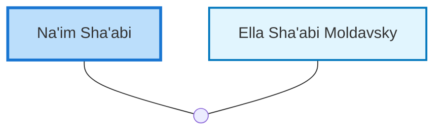

<dl class="profile-info-list">
<dt>Birth:</dt><dd>June 10, 1931 at <a href="https://en.wikipedia.org/wiki/Iraq">Iraq</a></dd>
<dt>Parents:</dt><dd>—</dd>
<dt>Siblings:</dt><dd>—</dd>
<dt>Spouse:</dt><dd><a href="/profiles/Ella-Sha%27abi-Moldavsky">Ella Sha'abi Moldavsky</a></dd>
<dt>Children:</dt><dd>—</dd>
</dl>

---

## Nuclear Family

