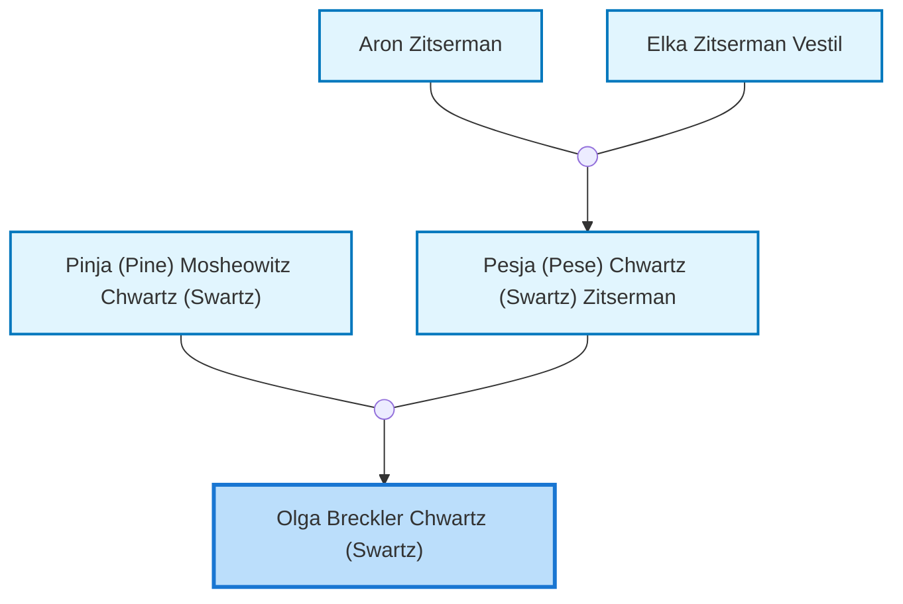
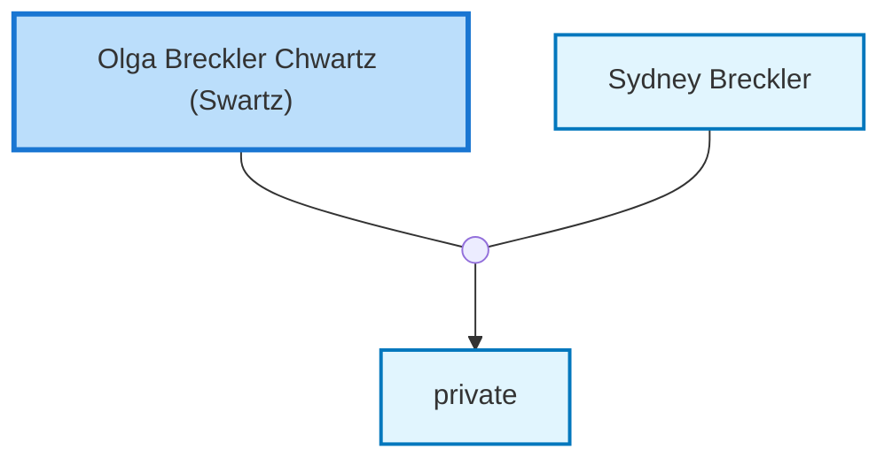

<dl class="profile-info-list">
<dt>Birth:</dt><dd>April 25, 1919 at <a href="https://en.wikipedia.org/wiki/Bershad">Bershad, Ukraine</a></dd>
<dt>Death:</dt><dd>December 3, 1995</dd>
<dt>Parents:</dt><dd><a href="/profiles/Pinja-%28Pine%29-Mosheowitz-Chwartz-%28Swartz%29">Pinja (Pine) Mosheowitz Chwartz (Swartz)</a>, <a href="/profiles/Pesja-%28Pese%29-Chwartz-%28Swartz%29-Zitserman">Pesja (Pese) Chwartz (Swartz) Zitserman</a></dd>
<dt>Siblings:</dt><dd><a href="/profiles/Leah-Dzienciol-Chwartz-%28Swartz%29">Leah Dzienciol Chwartz (Swartz)</a>, <a href="/profiles/Rachel-%28Rae%29-Borsky-Chwartz-%28Swartz%29">Rachel (Rae) Borsky Chwartz (Swartz)</a>, <a href="/profiles/May-Adam-Chwartz-%28Swartz%29">May Adam Chwartz (Swartz)</a>, <a href="/profiles/Morris-Swartz">Morris Swartz</a>, <a href="/profiles/Aaron-%28Harry%29-Swartz">Aaron (Harry) Swartz</a></dd>
<dt>Spouse:</dt><dd><a href="/profiles/Sydney-Breckler">Sydney Breckler</a></dd>
<dt>Children:</dt><dd>private</dd>
</dl>

---

## Immediate Family

```mermaid
flowchart TD
classDef person fill:#e1f5fe,stroke:#0277bd,stroke-width:2px;
classDef internal-link fill:#e1f5fe,stroke:#0277bd,stroke-width:2px;
classDef current fill:#bbdefb,stroke:#1976d2,stroke-width:3px;
idI34831671878["Olga Breckler Chwartz (Swartz)"]
class idI34831671878 current
click idI34831671878 "../profiles/Olga-Breckler-Chwartz-%28Swartz%29" "Olga Breckler Chwartz (Swartz)"
idI15406658["Pinja (Pine) Mosheowitz Chwartz (Swartz)"]
class idI15406658 internal-link
click idI15406658 "../profiles/Pinja-%28Pine%29-Mosheowitz-Chwartz-%28Swartz%29" "Pinja (Pine) Mosheowitz Chwartz (Swartz)"
idI10033320293["Pesja (Pese) Chwartz (Swartz) Zitserman"]
class idI10033320293 internal-link
click idI10033320293 "../profiles/Pesja-%28Pese%29-Chwartz-%28Swartz%29-Zitserman" "Pesja (Pese) Chwartz (Swartz) Zitserman"
marriage_idF5270059((" "))
idI15406658 --- marriage_idF5270059
idI10033320293 --- marriage_idF5270059
marriage_idF5270059 --> idI34831671878
idI7850920["Leah Dzienciol Chwartz (Swartz)"]
class idI7850920 internal-link
click idI7850920 "../profiles/Leah-Dzienciol-Chwartz-%28Swartz%29" "Leah Dzienciol Chwartz (Swartz)"
marriage_idF5270059 --> idI7850920
idI34831671909["Rachel (Rae) Borsky Chwartz (Swartz)"]
class idI34831671909 internal-link
click idI34831671909 "../profiles/Rachel-%28Rae%29-Borsky-Chwartz-%28Swartz%29" "Rachel (Rae) Borsky Chwartz (Swartz)"
marriage_idF5270059 --> idI34831671909
idI34831671902["May Adam Chwartz (Swartz)"]
class idI34831671902 internal-link
click idI34831671902 "../profiles/May-Adam-Chwartz-%28Swartz%29" "May Adam Chwartz (Swartz)"
marriage_idF5270059 --> idI34831671902
idI34831671963["Morris Swartz"]
class idI34831671963 internal-link
click idI34831671963 "../profiles/Morris-Swartz" "Morris Swartz"
marriage_idF5270059 --> idI34831671963
idI34831671951["Aaron (Harry) Swartz"]
class idI34831671951 internal-link
click idI34831671951 "../profiles/Aaron-%28Harry%29-Swartz" "Aaron (Harry) Swartz"
marriage_idF5270059 --> idI34831671951
```

## Ancestors (up to 2 Gen.)

## Nuclear Family

