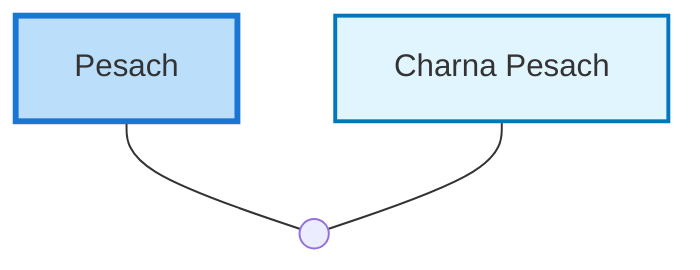

<dl class="profile-info-list">
<dt>Parents:</dt><dd>—</dd>
<dt>Siblings:</dt><dd>—</dd>
<dt>Spouse:</dt><dd><a href="/profiles/Charna-Pesach">Charna Pesach</a></dd>
<dt>Children:</dt><dd>—</dd>
</dl>

---

## Nuclear Family

