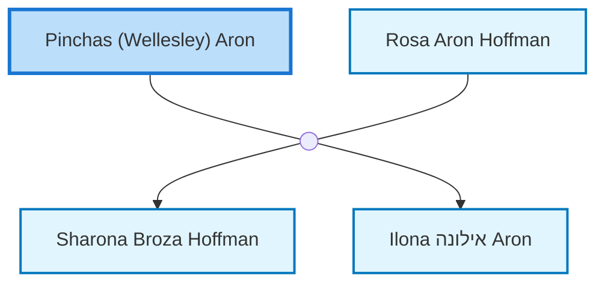

<dl class="profile-info-list">
<dt>Birth:</dt><dd>1901</dd>
<dt>Death:</dt><dd>1988</dd>
<dt>Parents:</dt><dd>—</dd>
<dt>Siblings:</dt><dd>—</dd>
<dt>Spouse:</dt><dd><a href="/profiles/Rosa-Aron-Hoffman">Rosa Aron Hoffman</a></dd>
<dt>Children:</dt><dd><a href="/profiles/Sharona-Broza-Hoffman">Sharona Broza Hoffman</a>, <a href="/profiles/Ilona-%D7%90%D7%99%D7%9C%D7%95%D7%A0%D7%94-Aron">Ilona אילונה Aron</a></dd>
</dl>

---

## Nuclear Family

