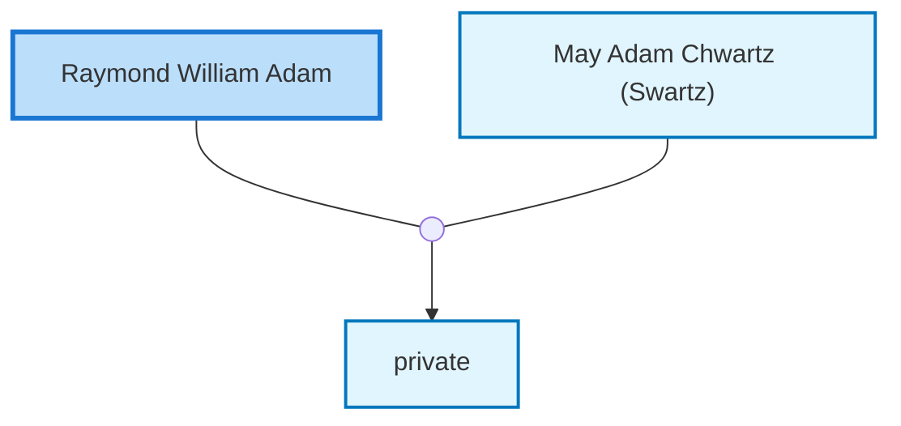

<dl class="profile-info-list">
<dt>Birth:</dt><dd>August 25, 1924 at <a href="https://en.wikipedia.org/wiki/Subiaco,_WA,_Australia">Subiaco, WA, Australia</a></dd>
<dt>Death:</dt><dd>June 18, 1987 at <a href="https://en.wikipedia.org/wiki/Dalkeith,_Western_Australia,_Australia">Dalkeith, Western Australia, Australia</a></dd>
<dt>Parents:</dt><dd>—</dd>
<dt>Siblings:</dt><dd>—</dd>
<dt>Spouse:</dt><dd><a href="/profiles/May-Adam-Chwartz-%28Swartz%29">May Adam Chwartz (Swartz)</a></dd>
<dt>Children:</dt><dd>private</dd>
</dl>

---

## Nuclear Family

