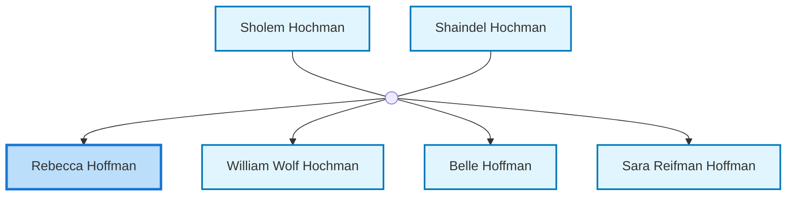
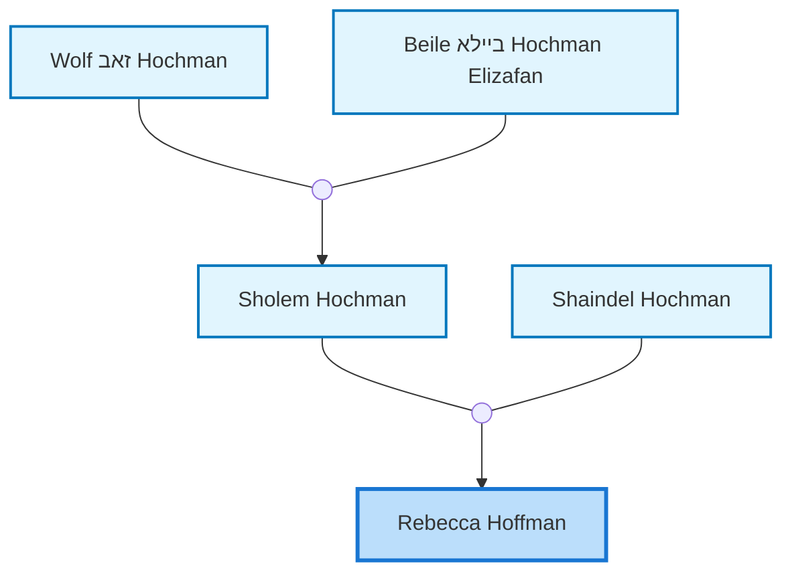

<dl class="profile-info-list">
<dt>Parents:</dt><dd><a href="/profiles/Sholem-Hochman">Sholem Hochman</a>, <a href="/profiles/Shaindel-Hochman">Shaindel Hochman</a></dd>
<dt>Siblings:</dt><dd><a href="/profiles/William-Wolf-Hochman">William Wolf Hochman</a>, <a href="/profiles/Belle-Hoffman">Belle Hoffman</a>, <a href="/profiles/Sara-Reifman-Hoffman">Sara Reifman Hoffman</a></dd>
<dt>Spouse:</dt><dd>—</dd>
<dt>Children:</dt><dd>—</dd>
</dl>

---

## Immediate Family

## Ancestors (up to 2 Gen.)

