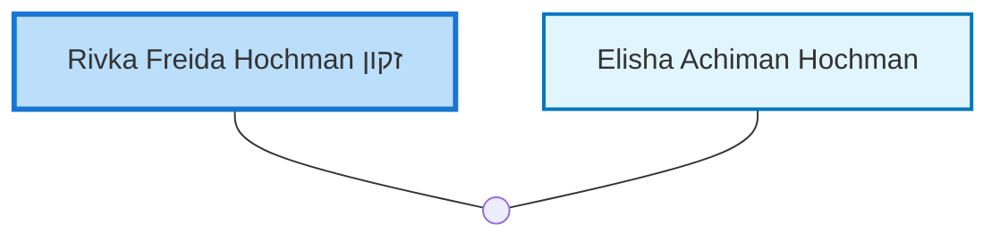

<dl class="profile-info-list">
<dt>Birth:</dt><dd>1937 at <a href="https://en.wikipedia.org/wiki/Tel_Aviv-Yafo,_Tel_Aviv_District,_Israel">Tel Aviv-Yafo, Tel Aviv District, Israel</a></dd>
<dt>Parents:</dt><dd>—</dd>
<dt>Siblings:</dt><dd>—</dd>
<dt>Spouse:</dt><dd><a href="/profiles/Elisha-Achiman-Hochman">Elisha Achiman Hochman</a></dd>
<dt>Children:</dt><dd>—</dd>
</dl>

---

## Nuclear Family

