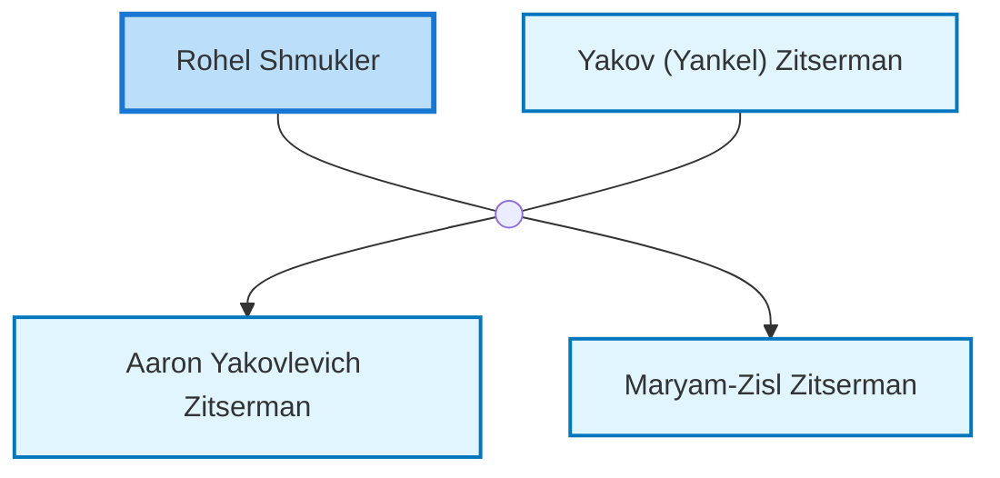

<dl class="profile-info-list">
<dt>Birth:</dt><dd>1881</dd>
<dt>Death:</dt><dd>1970</dd>
<dt>Parents:</dt><dd>—</dd>
<dt>Siblings:</dt><dd>—</dd>
<dt>Spouse:</dt><dd><a href="/profiles/Yakov-%28Yankel%29-Zitserman">Yakov (Yankel) Zitserman</a></dd>
<dt>Children:</dt><dd><a href="/profiles/Aaron-Yakovlevich-Zitserman">Aaron Yakovlevich Zitserman</a>, <a href="/profiles/Maryam-Zisl-Zitserman">Maryam-Zisl Zitserman</a></dd>
</dl>

---

## Nuclear Family

