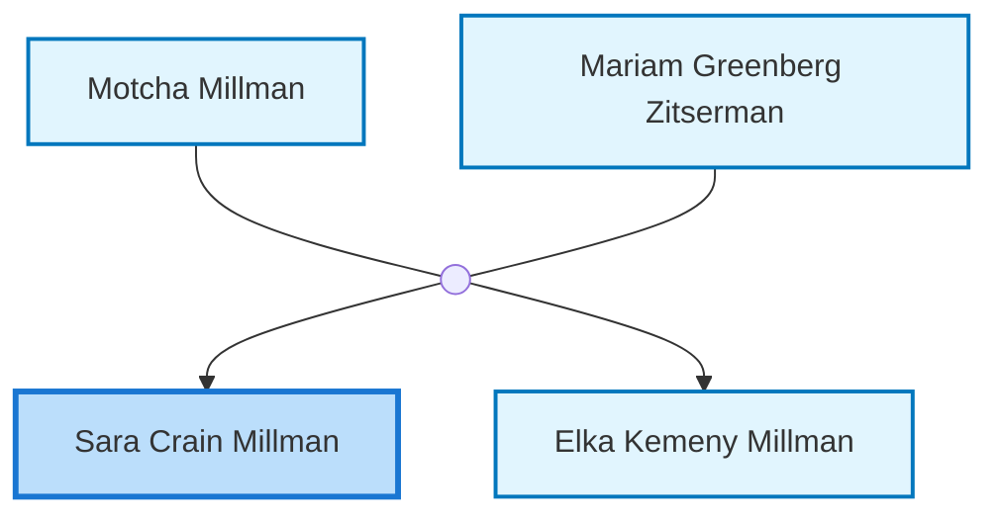
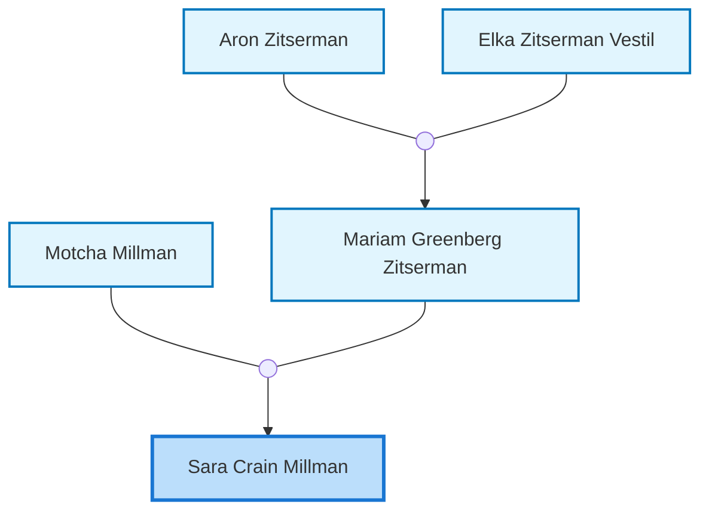
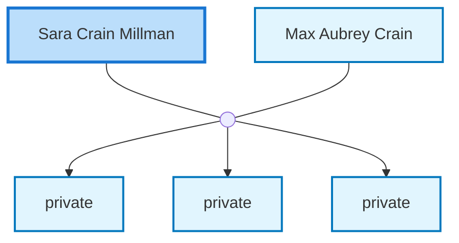

<dl class="profile-info-list">
<dt>Nick:</dt><dd>Sally</dd>
<dt>Birth:</dt><dd>circa 1926 at <a href="https://en.wikipedia.org/wiki/Bershad">Bershad, Ukraine</a></dd>
<dt>Parents:</dt><dd><a href="/profiles/Motcha-Millman">Motcha Millman</a>, <a href="/profiles/Mariam-Greenberg-Zitserman">Mariam Greenberg Zitserman</a></dd>
<dt>Siblings:</dt><dd><a href="/profiles/Elka-Kemeny-Millman">Elka Kemeny Millman</a></dd>
<dt>Spouse:</dt><dd><a href="/profiles/Max-Aubrey-Crain">Max Aubrey Crain</a></dd>
<dt>Children:</dt><dd>private, private, private</dd>
</dl>

---

## Immediate Family

## Ancestors (up to 2 Gen.)

## Nuclear Family

