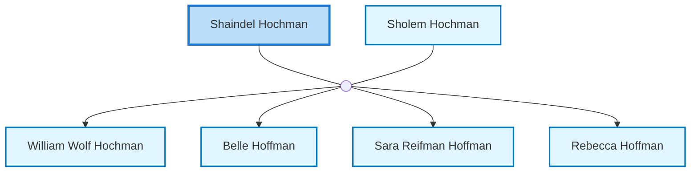

<dl class="profile-info-list">
<dt>Parents:</dt><dd>—</dd>
<dt>Siblings:</dt><dd>—</dd>
<dt>Spouse:</dt><dd><a href="/profiles/Sholem-Hochman">Sholem Hochman</a></dd>
<dt>Children:</dt><dd><a href="/profiles/William-Wolf-Hochman">William Wolf Hochman</a>, <a href="/profiles/Belle-Hoffman">Belle Hoffman</a>, <a href="/profiles/Sara-Reifman-Hoffman">Sara Reifman Hoffman</a>, <a href="/profiles/Rebecca-Hoffman">Rebecca Hoffman</a></dd>
</dl>

---

## Nuclear Family

