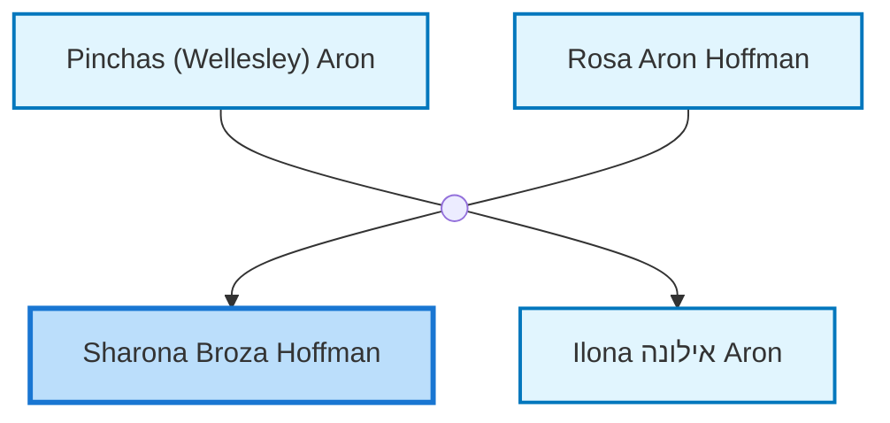
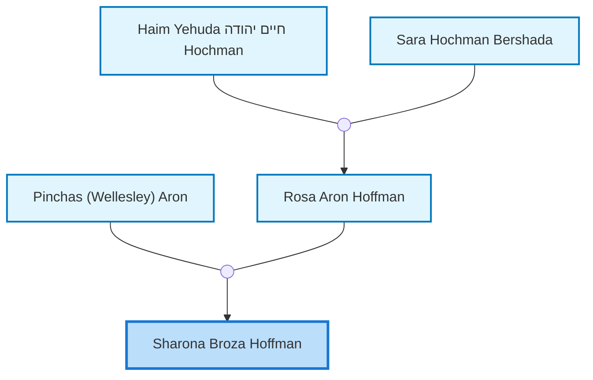
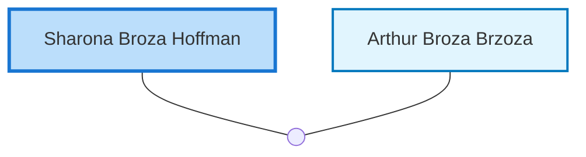

<dl class="profile-info-list">
<dt>Birth:</dt><dd>December 7, 1927 at <a href="https://en.wikipedia.org/wiki/Tel_Aviv,_Israel">Tel Aviv, Israel</a></dd>
<dt>Death:</dt><dd>June 2005 at <a href="https://en.wikipedia.org/wiki/Tel_Aviv,_Israel">Tel Aviv, Israel</a></dd>
<dt>Parents:</dt><dd><a href="/profiles/Pinchas-%28Wellesley%29-Aron">Pinchas (Wellesley) Aron</a>, <a href="/profiles/Rosa-Aron-Hoffman">Rosa Aron Hoffman</a></dd>
<dt>Siblings:</dt><dd><a href="/profiles/Ilona-%D7%90%D7%99%D7%9C%D7%95%D7%A0%D7%94-Aron">Ilona אילונה Aron</a></dd>
<dt>Spouse:</dt><dd><a href="/profiles/Arthur-Broza-Brzoza">Arthur Broza Brzoza</a></dd>
<dt>Children:</dt><dd>—</dd>
</dl>

---

## Immediate Family

## Ancestors (up to 2 Gen.)

## Nuclear Family

