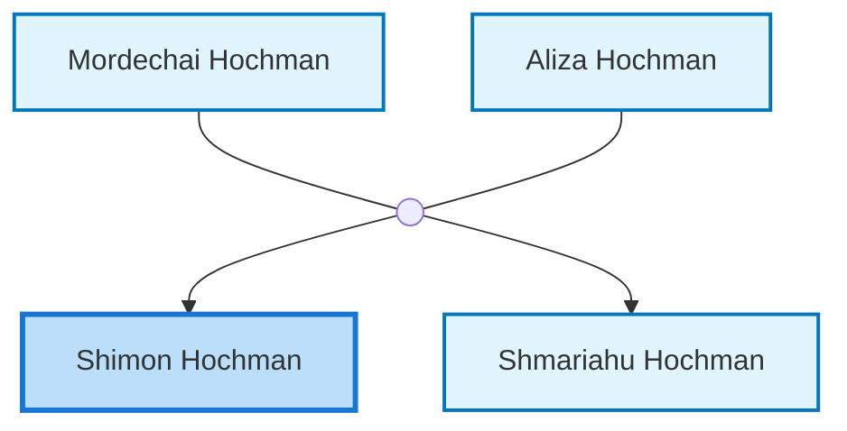
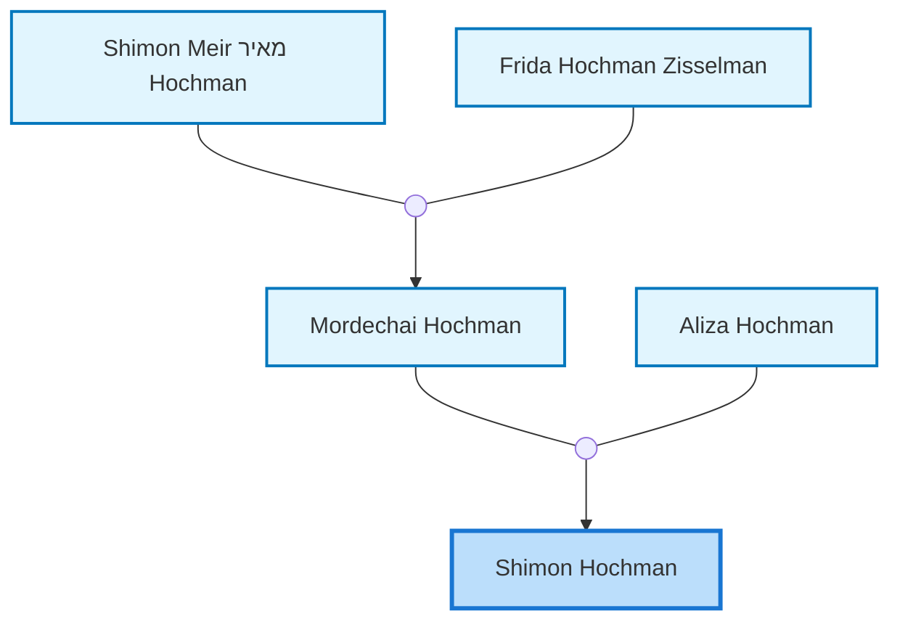
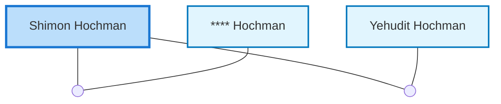

<dl class="profile-info-list">
<dt>Parents:</dt><dd><a href="/profiles/Mordechai-Hochman">Mordechai Hochman</a>, <a href="/profiles/Aliza-Hochman">Aliza Hochman</a></dd>
<dt>Siblings:</dt><dd><a href="/profiles/Shmariahu-Hochman">Shmariahu Hochman</a></dd>
<dt>Spouse:</dt><dd><a href="/profiles/____-Hochman">**** Hochman</a>, <a href="/profiles/Yehudit-Hochman">Yehudit Hochman</a></dd>
<dt>Children:</dt><dd>—</dd>
</dl>

---

## Immediate Family

## Ancestors (up to 2 Gen.)

## Nuclear Family

