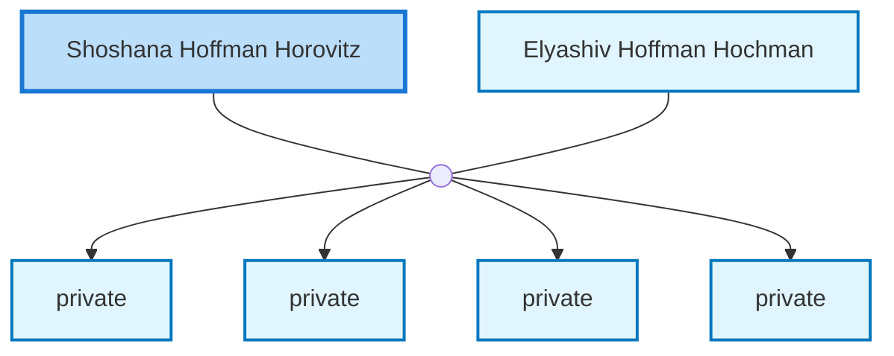

<dl class="profile-info-list">
<dt>Birth:</dt><dd>August 28, 1918 at <a href="https://en.wikipedia.org/wiki/Dubrovytsya,_Dubrovyts&#39;kyi_district,_Rivne_Oblast,_Ukraine">Dubrovytsya, Dubrovyts&#39;kyi district, Rivne Oblast, Ukraine</a></dd>
<dt>Death:</dt><dd>November 23, 2003</dd>
<dt>Parents:</dt><dd>—</dd>
<dt>Siblings:</dt><dd>—</dd>
<dt>Spouse:</dt><dd><a href="/profiles/Elyashiv-Hoffman-Hochman">Elyashiv Hoffman Hochman</a></dd>
<dt>Children:</dt><dd>private, private, private, private</dd>
</dl>

---

## Nuclear Family

