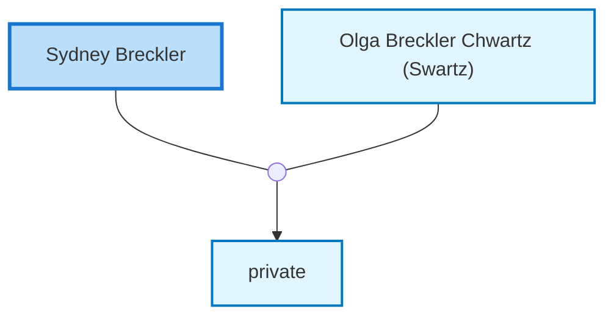

<dl class="profile-info-list">
<dt>Birth:</dt><dd>circa 1910</dd>
<dt>Death:</dt><dd>March 30, 1971</dd>
<dt>Parents:</dt><dd>—</dd>
<dt>Siblings:</dt><dd>—</dd>
<dt>Spouse:</dt><dd><a href="/profiles/Olga-Breckler-Chwartz-%28Swartz%29">Olga Breckler Chwartz (Swartz)</a></dd>
<dt>Children:</dt><dd>private</dd>
</dl>

---

## Nuclear Family

